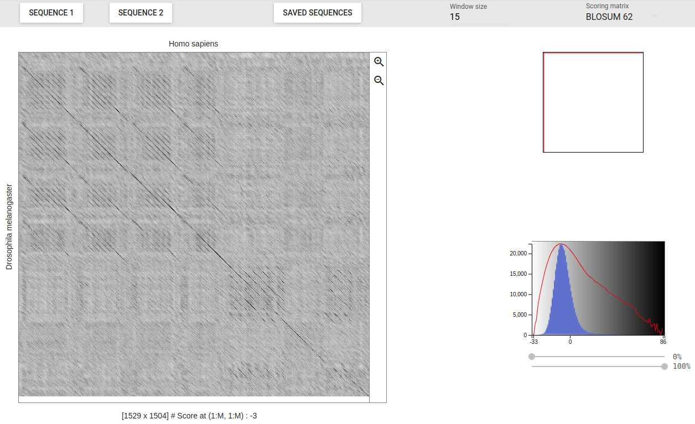
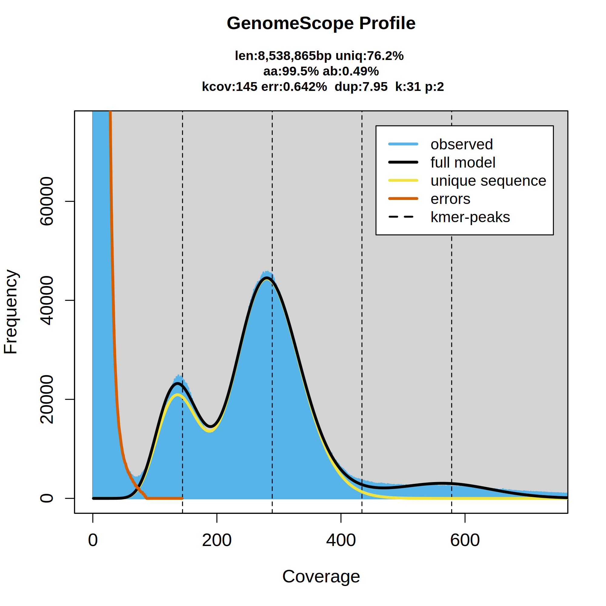

# Genômica e Bioinformática - CEN5789 
Aulas práticas da disciplina ["CEN5789 - Genômica e Bioinformática"](https://uspdigital.usp.br/janus/componente/disciplinasOferecidasInicial.jsf?action=3&sgldis=CEN5789)

__Criador e Instrutor__²
Diego M. Riaño-Pachón

# Bioinformática

Os exercícios serão realizados nos computadores da sala de computadores da central de aulas do CENA/USP. Por favor, entre no computador usando o sistema operacional Ubuntu e o usuário cen5789.

## Bioinfo 1 - Operacoes básicas em Bioinformática

### Ferramentas do Unix úteis na bioinformática.

Após adquirir alguma familiaridade com os fundamentos do [sistema operacional Linux](unix.md), vamos explorar como alguns de seus comandos mais básicos podem ser extremamente úteis na área de bioinformática. Você entenderá por que o Linux é o sistema operacional de escolha na bioinformática.

Para realizar esses exercícios, você precisa usar o arquivo [file1.tar.gz](files/file1.tar.gz). Após baixá-lo, o arquivo deve estar na sua pasta "Downloads". Você deve descompactá-lo em seu diretório HOME.

```
cd
mv ~/Downloads/file1.tar.gz ~/
tar xvzf file1.tar.gz
```

#### Algumas operações básicas com arquivos.

Usando alguns comandos do UNIX, podemos obter informações sobre arquivos e o conteúdo deles de forma rápida e eficiente, muitas vezes sem a necessidade de abrir o arquivo, que pode ser muito grande, para obter essas informações.

No subdiretório "~/dia1/", encontre o arquivo "TAIR10_pep_20101214_updated.fasta.gz", que corresponde à base de dados de sequências de proteínas previstas no genoma da planta modelo _Arabidopsis thaliana_. Para saber quantas linhas este arquivo possui, descomprioma o arquivo e conte o número de linhas com os comandos:

```
cd 
cd ~/dia1
gunzip TAIR10_pep_20101214_updated.fasta.gz
wc -l TAIR10_pep_20101214_updated.fasta
```
Pode conhecer o tamnho do arquivo com o comando _ls_:

```
ls -l -h TAIR10_pep_20101214_updated.fasta
```

O que faz a opção -h no comando 'ls'? Consulte a página de manual do _ls_ para saber."

Na maioria das vezes, é importante visualizar o conteúdo do arquivo, seja no início ou no final.  No entanto, devido ao grande tamanho dos arquivos com os quais normalmente se trabalha, não é conveniente abrir o arquivo com nenhum editor de texto, pois isso pode reduzir o tempo de resposta do computador. Podemos visualizar as primeiras ou ultimas linahs de um arquivo de texto com os comandos  _head_ e _tail_ respetivamente

```
head TAIR10_pep_20101214_updated.fasta
tail TAIR10_pep_20101214_updated.fasta
```
Esses comandos mostram as primeirais ou ultimas 10 linhas do arquivo. O que você pode fazer para mostrar um número maior de linhas? Consulte a página de manual do  _head_ 

Repare na saída do comando `head`. Está mostrando um registro de sequência no formato 'fasta'. Este formato é o mais simples para armazenar sequências, tanto de ácidos nucleicos quanto de proteínas. Sua estrutura é muito simples. Cada registro começa com uma linha que tem no seu início o sinal _>_ seguido de uma cadeia de caracteres de comprimento arbitrário que funciona como o identificador da sequência. Em seguida, nas linhas subsequentes, aparece a sequência em si, em quantas linhas forem necessárias.

Pode usar o comando _grep_ para localizar todas as linhas que tem um padrão de texto específico, ou seja, uma cadeia de texto específica. Vamos identificar todas a linas que comecam com o sinal _>_

```
grep ">" TAIR10_pep_20101214_updated.fasta
```

São muitas linhas, vamos usar o _pipe_ para examinar só as primeiras 4 linas com o padrão de texto:

```
grep ">" TAIR10_pep_20101214_updated.fasta | head -n 4
```

#### Formatos de sequências

Existem diferentes formatos para sequências, geralmente em texto simples. Isso significa que elas podem ser visualizadas e editadas com qualquer editor de texto, como vi ou pico. Alguns desses formatos são mais comuns do que outros, e muitos programas de bioinformática aceitam vários dos formatos mais comuns ([Leonard et al., 2007](https://pubmed.ncbi.nlm.nih.gov/18428774/)).

Todos os formatos de sequências têm uma característica (campo) em comum: um identificador para cada sequência, para que esta possa ser reconhecida de forma única.

##### Fasta

O formato mais simples é conhecido como Fasta. Nele, uma entrada, que é uma sequência, é dividida em duas partes: a linha de identificação, que deve começar com o símbolo ">" seguido imediatamente pelo identificador da sequência, que pode ser qualquer cadeia de caracteres sem espaços. As linhas imediatamente após o identificador correspondem à própria sequência.

O formato Fasta é o formato de sequências mais amplamente utilizado em aplicações de bioinformática.

```
>gi|110742030|dbj|BAE98952.1| putative NAC domain protein [Arabidopsis thaliana]
MEDQVGFGFRPNDEELVGHYLRNKIEGNTSRDVEVAISEVNICSYDPWNLRFQSKYKSRDAMWYFFSRRE
NNKGNRQSRTTVSGKWKLTGESVEVKDQWGFCSEGFRGKIGHKRVLAFLDGRYPDKTKSDWVIHEFHYDL
LPEHQRTYVICRLEYKGDDADILSAYAIDPTPAFVPNMTSSAGSVVNQSRQRNSGSYNTYSEYDSANHGQ
QFNENSNIMQQQPLQGSFNPLLEYDFANHGGQWLSDYIDLQQQVPYLAPYENESEMIWKHVIEENFEFLV
DERTSMQQHYSDHRPKKPVSGVLPDDSSDTETGSMIFEDTSSSTDSVGSSDEPGHTRIDDIPSLNIIEPL
HNYKAQEQPKQQSKEKVISSQKSECEWKMAEDSIKIPPSTNTVKQSWIVLENAQWNYLKNMIIGVLLFIS
VISWIILVG
```

##### GenBank

O formato GenBank é utilizado pelo 'National Center for Biotechnology Information' ([NCBI](https://www.ncbi.nlm.nih.gov/)), o maior repositório de sequências de ácidos nucleicos e proteínas do mundo. O NCBI, juntamente com o [EMBL-EBI](https://www.ebi.ac.uk/) e o [DDBJ](https://www.ddbj.nig.ac.jp/), mantém conjuntamente o 'The International Nucleotide Sequence Database' ([Mizrachi, 2008](https://pubmed.ncbi.nlm.nih.gov/27896718/)).

Uma entrada neste formato é composta por duas partes. A primeira parte abrange as posições de 1 a 10 e geralmente contém o nome do campo, como LOCUS, DEFINITION, ACCESSION ou SOURCE. A segunda parte de cada entrada contém informações correspondentes ao campo em questão. Cada entrada é finalizada com o símbolo '//'. Você pode encontrar mais informações sobre esse tipo de arquivo [aqui](http://www.ncbi.nlm.nih.gov/Sitemap/samplerecord.html).

```
LOCUS       BAE98952                 429 aa            linear   PLN 27-JUL-2006
DEFINITION  putative NAC domain protein [Arabidopsis thaliana].
ACCESSION   BAE98952
VERSION     BAE98952.1
DBSOURCE    accession AK226863.1
KEYWORDS    .
SOURCE      Arabidopsis thaliana (thale cress)
  ORGANISM  Arabidopsis thaliana
            Eukaryota; Viridiplantae; Streptophyta; Embryophyta; Tracheophyta;
            Spermatophyta; Magnoliopsida; eudicotyledons; Gunneridae;
            Pentapetalae; rosids; malvids; Brassicales; Brassicaceae;
            Camelineae; Arabidopsis.
REFERENCE   1
  AUTHORS   Totoki,Y., Seki,M., Ishida,J., Nakajima,M., Enju,A., Morosawa,T.,
            Kamiya,A., Narusaka,M., Shin-i,T., Nakagawa,M., Sakamoto,N.,
            Oishi,K., Kohara,Y., Kobayashi,M., Toyoda,A., Sakaki,Y.,
            Sakurai,T., Iida,K., Akiyama,K., Satou,M., Toyoda,T., Konagaya,A.,
            Carninci,P., Kawai,J., Hayashizaki,Y. and Shinozaki,K.
  TITLE     Large-scale analysis of RIKEN Arabidopsis full-length (RAFL) cDNAs
  JOURNAL   Unpublished
REFERENCE   2  (residues 1 to 429)
  AUTHORS   Totoki,Y., Seki,M., Ishida,J., Nakajima,M., Enju,A., Morosawa,T.,
            Kamiya,A., Narusaka,M., Shin-i,T., Nakagawa,M., Sakamoto,N.,
            Oishi,K., Kohara,Y., Kobayashi,M., Toyoda,A., Sakaki,Y.,
            Sakurai,T., Iida,K., Akiyama,K., Satou,M., Toyoda,T., Konagaya,A.,
            Carninci,P., Kawai,J., Hayashizaki,Y. and Shinozaki,K.
  TITLE     Direct Submission
  JOURNAL   Submitted (26-JUL-2006) Motoaki Seki, RIKEN Plant Science Center;
            1-7-22 Suehiro-cho, Tsurumi-ku, Yokohama, Kanagawa 230-0045, Japan
            (E-mail:mseki@psc.riken.jp, URL:http://rarge.gsc.riken.jp/,
            Tel:81-45-503-9625, Fax:81-45-503-9586)
COMMENT     An Arabidopsis full-length cDNA library was constructed essentially
            as reported previously (Seki et al. (1998) Plant J. 15:707-720;
            Seki et al. (2002) Science 296:141-145).
            This clone is in a modified pBluescript vector.
            Please visit our web site (http://rarge.gsc.riken.jp/) for further
            details.
FEATURES             Location/Qualifiers
     source          1..429
                     /organism="Arabidopsis thaliana"
                     /db_xref="taxon:3702"
                     /chromosome="1"
                     /clone="RAFL08-19-M04"
                     /ecotype="Columbia"
                     /note="common name: thale cress"
     Protein         1..429
                     /product="putative NAC domain protein"
     Region          5..137
                     /region_name="NAM"
                     /note="No apical meristem (NAM) protein; pfam02365"
                     /db_xref="CDD:426740"
     CDS             1..429
                     /gene="At1g01010"
                     /coded_by="AK226863.1:89..1378"
ORIGIN      
        1 medqvgfgfr pndeelvghy lrnkiegnts rdvevaisev nicsydpwnl rfqskyksrd
       61 amwyffsrre nnkgnrqsrt tvsgkwkltg esvevkdqwg fcsegfrgki ghkrvlafld
      121 grypdktksd wvihefhydl lpehqrtyvi crleykgdda dilsayaidp tpafvpnmts
      181 sagsvvnqsr qrnsgsynty seydsanhgq qfnensnimq qqplqgsfnp lleydfanhg
      241 gqwlsdyidl qqqvpylapy enesemiwkh vieenfeflv dertsmqqhy sdhrpkkpvs
      301 gvlpddssdt etgsmifedt ssstdsvgss depghtridd ipslniiepl hnykaqeqpk
      361 qqskekviss qksecewkma edsikippst ntvkqswivl enaqwnylkn miigvllfis
      421 viswiilvg
//
```

#### Algumas operações básicas com sequências no formato Fasta

Durante o restante desta seção e na próxima, usaremos apenas sequências no formato Fasta. Por favor, verifique se as sequências de _A. thaliana_ no arquivo 'TAIR10_pep_20101214_updated.fasta' estão neste formato. Você pode usar o comando `head nome_do_arquivo` ou o comando `less nome_do_arquivo` para fazer isso.

Você já teve que contar o número de sequências num arquivo ou alterar o identificador das sequências no formato Fasta? Se fossem apenas algumas sequências, isso poderia ser feito facilmente em qualquer editor de texto. No entanto, quando se trata de milhares de sequências, a opção de usar um editor de texto deixa de ser viável. Felizmente, alguns comandos do Unix nos permitem realizar essas tarefas simples de forma rápida.

Como observado anteriormente, o comando `grep` pode nos ajudar a contar o número de sequências em um arquivo Fasta. O modificador `-c` conta o número de linhas que contêm um padrão específico em um arquivo, e podemos aproveitar o fato de que em um arquivo Fasta o símbolo _>_ aparece uma única vez para cada sequência. Para contar o número de sequencias armazenadas no arquivo pode usar o comando:

```
grep -c ">" TAIR10_pep_20101214_updated.fasta
```

Em outras situações, é importante modificar o identificador de cada sequência para incluir, por exemplo, uma abreviatura que represente o nome da espécie à qual a sequência pertence. Novamente, o Unix nos permite fazer essa alteração rapidamente usando o comando `sed`. Vamos adicionar a partícula 'ATH' a cada um dos identificadores do arquivo, aproveitando o fato de que à esquerda de cada identificador temos o símbolo '>'. Observe que os resultados desta operação estão sendo armazenados em um novo arquivo:

```
sed 's/>/>ATH_/' TAIR10_pep_20101214_updated.fasta > TAIR10_pep_20101214_updated.mod.fasta
```
As linhas com os identificadores neste arquivo são muito extensas, para muitos programas isto não é desejável. Vamos eliminar tudo que aparecer depois do primeiro ' |'. Para isso vamos usar [regular expressions](https://www.gnu.org/software/sed/manual/html_node/Regular-Expressions.html).

```
sed -r 's/ | .*$//' TAIR10_pep_20101214_updated.mod.fasta > TAIR10_pep_20101214_updated.mod2.fasta
```
## Bioinfo 2 - Análise de Sequências

### Dotplots - Matrices de pontos

Eu recomendo que você trabalhe na pasta `~/dia2`.

As matrizes de pontos ('Dot Plot') são ferramentas exploratórias para a comparação de cadeias de texto, ou seja, sequências. Entre outras funcionalidades, elas nos permitem facilmente identificar regiões repetidas em uma sequência ao compará-la com ela mesma. Também podemos obter uma ideia bastante clara da estrutura de um gene ao comparar a sequência de sua região codificante com a sequência do locus onde ele se encontra.

Os dotplots são frequentemente usados para ilustrar comparações de genomas ou cromossomos, como exemplificado na Figura 1 [deste artigo](https://academic.oup.com/nar/article/39/10/e68/1310457) ou na Figura 2 [deste outro](https://bmcgenomics.biomedcentral.com/articles/10.1186/s12864-021-07534-0).

Nesta seção, utilizaremos a implementação de matrizes de pontos do Instituto Suíço de Bioinformática, conhecida como [Dotlet JS](https://dotlet.vital-it.ch/), para realizar comparações de pequenas sequências, conforme ilustrado na Figura:



Em seguida, estudaremos alguns exemplos provenientes da documentação do [DotLet](https://myhits.sib.swiss/util/dotlet/doc/dotlet_help.html).

#### Sequências repetidas

Faça uma comparação da sequência [SLIT_DROME](files/slit_drome.fa) contra ela mesma . Copie a sequência, em seguida clique no botão 'SEQUENCE 1', faz o mesmo para o botão 'SEQUENCE 2'.

À direita dos botões onde você carregou a sequência, encontrará uma lista suspensa que permite a seleção da matriz de substituição. Logo abaixo, há outra lista suspensa que permite escolher os tamanhos da janela a serem utilizados na comparação das duas sequências.

Após o cálculo da matriz de pontos, a tela será semelhante à figura anterior. No centro da página, à esquerda, encontra-se a matriz de pontos propriamente dita, na qual padrões de linhas diagonais podem ser observados. À direita, há um histograma das pontuações das comparações dos aminoácidos.

O tamanho da janela (_window size_) afeta a visualização na matriz de pontos, pois determina o tamanho da área que está sendo analisada de cada vez. Janelas maiores podem mostrar uma visão mais ampla e suavizada da comparação, enquanto janelas menores podem mostrar detalhes finos e repetições mais curtas.

A linha vermelha no histograma de pontuações representa os mesmos valores das barras azuis, mas em uma escala logarítmica. Essa escala é frequentemente empregada para realçar as pontuações extremamente altas, que, de outra forma, seriam menos visíveis devido à sua baixa frequência. Isso ajuda a identificar áreas de interesse na matriz de pontos.

Este dotplot é da proteína [__SLIT__ de _Drosophila melanogaster_](https://www.uniprot.org/uniprotkb/P24014/entry) em relação a si mesma. Ela possui várias regiões repetidas. Na parte N-terminal (A), observamos quatro regiões repetidas, que são compostas por unidades menores repetidas (neste caso, repetições ricas em leucina). Em seguida, há outro domínio que se repete pelo menos seis vezes em um aglomerado compacto (B), com uma ocorrência adicional próxima ao C-terminus. Este último é um domínio EGF (fator de crescimento epidérmico).

A figura abaixo mostra a disposição dos domínios ao longo da sequência da proteína, conforme descrito na entrada do [Swiss-Prot](https://www.uniprot.org/uniprotkb/P24014/entry).


#### Domínios proteicos conservados

Agora carregue as sequencias [MS2_HUMAN](https://www.uniprot.org/uniprotkb/MS2_HUMAN) e [ADAM_CROAD](https://www.uniprot.org/uniprotkb/ADAM_CROAD).

A sequência horizontal representa o antígeno de superfície celular MS2 humano, enquanto a vertical representa a adamalisina II, uma metaloprotease proveniente do veneno da serpente _Crotalus adamanteus_ (cascavel de cauda de chocalho do leste). Ambos contêm um domínio de metaloprotease de zinco; como a imagem mostra, a adamalisina consiste apenas deste domínio, enquanto ele representa aproximadamente um quarto da proteína MS2.


Modifique os valores de _Window Size_ para 15, 25, 35 e 45, por exemplo, e a _Scoring Matrix_ para cada uma das matrizes BLOSUM. Como esses parâmetros afetam o dotplot?

#### Éxons e Íntrons

O [ANAC092](https://www.ncbi.nlm.nih.gov/pmc/articles/PMC3001574/) é um fator de transcrição da família NAC em _Arabidopsis thaliana_, identificado com o código [AT5G39610.1](https://www.arabidopsis.org/servlets/TairObject?id=133421&type=locus) no genoma da planta. O gene que codifica este produto gênico tem três éxons e dois íntrons.

Carregue a sequência genômica do [ANAC092](files/ANAC092_genomic.fasta) como 'SEQUENCE 1' e a sequência de [cDNA](files/ANAC092_cDNA.fasta) como 'SEQUENCE 2' no Dotlet. Selecione a matriz Identity como Scoring Matrix e utilize vários valores de Window Size na análise. Como este parâmetro afeta a análise?


Pode identificar algum valor do parâmetro Window Size que permita visualizar sequências repetitivas no cDNA?"

#### Dotplots com EMBOSS e outros applicativos

O European Molecular Biology Open Software Suite [EMBOSS](http://emboss.open-bio.org/) é uma suite de software com mais de 200 aplicativos para a análise de sequências.

Nesta seção, vamos refazer os dotplots anteriores usando um aplicativo do EMBOSS. Qual aplicativo usar? Na linha de comandos, você pode usar o programa `wossname` para procurar aplicativos que tenham na sua descrição uma palavra-chave específica. Por exemplo, você pode procurar a palavra _dotplot_. Para obter mais informações sobre um aplicativo específico, você pode utilizar a página de manual `man` ou o comando `tfm`, seguido do nome do aplicativo.

Antes de utilizar os aplicativos do EMBOSS, é necessário ativar o ambiente onde o software foi instalado. Execute o seguinte comando no seu terminal. Os pacotes do EMBOSS estarão disponíveis nesse terminal. Se trocar de terminal, será necessário ativar o ambiente novamente.

```
conda activate emboss
```

Quando terminar de usar os aplicativos do EMBOSS, é importante desativar o ambiente para evitar conflitos com outros aplicativos que possam ser utilizados.


```
conda deactivate
```

Tanto o Dotlet JS quanto os programas de dotplot em EMBOSS têm algumas limitações, talvez a mais importante seja que não conseguem detectar facilmente repetições invertidas, como as que aparecem em estruturas secundárias de RNA.

Vamos usar o programa [Re-Dot-Table](https://www.bioinformatics.babraham.ac.uk/projects/redotable/) para comparar a sequência do arquivo [secondarystructure.fasta](files/secondatystructure.fasta) com ela mesma. 

Esta sequência adquire a estrutura secundária que aparece abaixo. Nesta estrutura, as regiões que formam _stems_ correspondem a repetições invertidas, que podem ser visualizadas como diagonais com inclinação oposta à diagonal principal no dotplot.


Para gerar o dotplot com o software __Re-Dot-Table__, é necessário ativar um ambiente Conda no qual o software foi previamente instalado e, em seguida, executar o aplicativo:

```
conda activate redotable
redotable
```
A seguinte figura mostra o resultado dessa comparação. Explore o efeito do tamanho da janela para gerar o dotplot.


Lembre-se de desativar seu ambiente.

```
conda deactivate
```


### Alinhamentos exatos de pares de sequências

#### cDNA vs Genoma

Além da substituição de um resíduo (aminoácido ou nucleotídeo) por outro, as sequências podem sofrer perdas ou ganhos de resíduos, ou seja, deleções ou inserções, comumente chamadas em conjunto de _indels_. Os dotplots não permitem incluir esse tipo de variações nas análises. Para isso, precisamos de algoritmos mais sofisticados de comparação de sequências, é aí que entram os algoritmos exatos de comparação de pares de sequências. Esses algoritmos podem ser globais ou locais. 

O algoritmo para alinhamento global exato foi proposto por [Needleman e Wuhsch em 1970](https://pubmed.ncbi.nlm.nih.gov/5420325/), usa a estratégia de [programação](https://www.spiceworks.com/tech/devops/articles/what-is-dynamic-programming/) [dinâmica](https://www.nature.com/articles/nbt0704-909) e, para um conjunto selecionado de parâmetros, garante encontrar o melhor alinhamento possível, por isso é considerado _exato_. É chamado de global porque seu objetivo é encontrar o alinhamento que envolve todos os resíduos das duas sequências sendo comparadas.

O algoritmo para alinhamento local foi proposto por [Smith e Waterman](https://www.sciencedirect.com/science/article/pii/0022283681900875?via%3Dihub) uma década após o desenvolvimento do algoritmo de alinhamento global. Ele também usa a estratégia de programação dinâmica e garante uma solução exata para um conjunto selecionado de parâmetros. No entanto, seu objetivo é diferente, o alinhamento produzido não precisa envolver todos os resíduos das duas sequências, mas apenas procura encontrar a subsequência mais longa comum (permitindo substituições e _indels_) entre as sequências de interesse.

Nesta aula prática vamos usar o programa `est2genome` da suite _EMBOSS_ para alinhar uma sequencia de _cDNA_ as uma sequencia genômica. Tenha presente que a sequencia genômica pode ter um comprimento muito maior que a sequencia de _cDNA_. O `est2genome` usa um algoritmo que combina as estrategias de alinhamento local e global. Segundo a sua propia [documentacao](https://emboss.bioinformatics.nl/cgi-bin/emboss/help/est2genome) os pasos do algoritmos são:

- __Paso 1__: É realizado um primeiro escaneamento Smith-Waterman para localizar a pontuação, o início e o fim do segmento com pontuação máxima (incluindo introns, é claro). Nenhuma outra informação de alinhamento é retida.
- __Paso 2__: Subsequências correspondentes aos segmentos de pontuação máxima são extraídas. Se o produto do comprimento dessas subsequências for menor que o parâmetro de área, os segmentos são realinhados usando o algoritmo Needleman-Wunsch, que neste caso dará o mesmo resultado que o Smith-Waterman, já que eles estão garantidos a se alinharem de ponta a ponta.
- __Paso 3__: Se o produto dos comprimentos exceder o limite de área, o alinhamento é dividido recursivamente, dividindo o EST ao meio e encontrando a posição no genoma que se alinha com o ponto médio do EST. O problema é então reduzido a alinhar as porções esquerda e direita das sequências separadamente e mesclar o resultado.

Por que você considera importante começar com uma varredura usando o algoritmo de Smith-Waterman?

Vamos usar a sequência genômica do [ANAC092](files/ANAC092_genomic.fasta) e a sequência de [cDNA](files/ANAC092_cDNA.fasta) para identificar o alinhamento que mostre as posições dos éxons e dos íntrons no genoma. Consulte a página de manual do `est2genome` e visualize o resultado do alinhamento com seu editor de texto favorito. Lembre-se de ativar o ambiente de emboss.

```
conda activate emboss
```

#### Proteínas

##### Matrices de substituição

Vamos inspecionar a matriz _BLOSUM62_ que está incluída no _EMBOSS_. Para isso, precisamos encontrar a pasta onde o _EMBOSS_ armazena as matrizes. Execute o seguinte comando:

```
embossdata EBLOSUM62
```

Alguma saída conterá a palavra '_exists_'. No meu caso, o caminho para a matriz BLOSUM62 é `/usr/share/EMBOSS/data/EBLOSUM62`, e é nesse arquivo que a matriz BLOSUM62 está armazenada. Pode visualizar o conteúdo do arquivo com o comando `less`. Basta executar o seguinte comando:

```
less /usr/share/EMBOSS/data/EBLOSUM62
```

Isso abrirá o arquivo EBLOSUM62 no visualizador de texto "less", permitindo que você role e visualize seu conteúdo.

Responda as seguintes perguntas:
- Onde estão as maiores pontuações? Explique.
- Qual é a substituição com a maior pontuação?
- Por que as identidades não têm sempre a mesma pontuação?

##### NACs

Os NACs são uma família de fatores de transcrição específicos de plantas [(Han et al., 2023)](https://pubmed.ncbi.nlm.nih.gov/37623750/). Neste exercício, vamos comparar uma proteína NAC de angiosperma [_Arabidopsis thaliana_](files/ANAC092_pep.fasta) e uma proteína NAC do musgo [_Physcomitrium patens_](files/PpNAC_pep.fasta).

Vamos realizar um alinhamento global entre as duas proteínas. Lembre-se de que o algoritmo de alinhamento global procura o alinhamento ideal que envolva as duas sequências inteiras.

Quais programas do EMBOSS podem realizar alinhamentos globais?

```
wossname global
```

Usaremos o programa `needle` para realizar uma comparação global entre essas duas sequências. Verifique em [timetree.org](https://timetree.org/) oo tempo de divergência entre as duas espécies.

Qual matriz BLOSUM considera mais adequada para comparar as duas sequências?

Execute a comparação das duas sequências, especificando a matriz selecionada, e compare os resultados usando a matriz BLOSUM90. Você pode consultar a página de manual do `needle` para aprender como especificar as opções:

```
man needle
```

Agora realizaremos um alinhamento local. O objetivo do alinhamento local é encontrar regiões de similaridade local, e não é necessário incluir as sequências completas. Esse tipo de alinhamento é muito útil para pesquisar bancos de dados ou quando você não tem uma ideia clara sobre a semelhança da sequência de interesse com sequências no banco de dados. Usaremos o programa `water` para realizar uma comparação local entre essas duas sequências. Você pode consultar a página de manual do `water` para ajudar na selecao de opções:

```
man water
```

Quão significativos são esses alinhamentos? Tente gerar uma sequência aleatória a partir de [ANAC092](files/ANAC092_pep.fasta) e refaça os alinhamentos exatos. Como a pontuação do alinhamento muda?

### Alinhamentos heurísticos de pares de sequências - Buscas em bancos de dados

Os alinhamentos exatos representam um grande desafio computacional em termos de recursos necessários. Quando estamos buscando uma sequência semelhante a um alvo em um banco de dados que contém milhões de sequências, muitas vezes é necessário relaxar os critérios de busca para obter respostas rápidas e satisfatórias, mesmo que não sejam a resposta perfeita (exata). É aqui que ferramentas como o __Basic Local Alignment Search Tool__ ([Altschul et al., 1990](https://pubmed.ncbi.nlm.nih.gov/2231712/)), podem e devem ser empregadas. É importante destacar que o BLAST é uma ferramenta projetada para realizar alinhamentos __locais__, permitindo encontrar regiões similares em sequências, em vez de buscar por correspondências globais.

O BLAST possui uma interface gráfica (_Grafical User Interface_ ou _GUI_) muito boa para buscar sequências no banco de dados da NCBI. 

#### BLAST na interface web

Utilize a sequência encontrada no arquivo [files/unknown_nuc.fasta](files/unknown_nuc.fasta) para realizar uma pesquisa BLAST, no site (https://blast.ncbi.nlm.nih.gov/Blast.cgi). Esta sequencia corresponde a um trascrito de _A. thaliana_ identificado num experimento. Realize a busca usando o programa `blastn`, i.e., "Nucleotide - Nucleotide" no genoma completo de _A. thaliana_. Quais opções você deve selecionar para restringir sua pesquisa aos cromossomos de Arabidopsis thaliana? Uma vez que o BLAST realiza a pesquisa usando alinhamentos locais, esse resultado fornecerá apenas uma ideia muito preliminar da localização do transcrito no genoma. No entanto, você pode usar essas informações para refinar a predição do locus do transcrito usando o `est2genome` do EMBOSS ou o [Splign do NCBI](https://www.ncbi.nlm.nih.gov/sutils/splign/). Quais opções você selecionou para realizar a pesquisa no BLAST? Por quê? Descreva os resultados da pesquisa.


Os resultados dessa pesquisa nos permitem concluir que o locus do transcrito está no cromossomo número 5 de A. thaliana. Quais são as coordenadas aproximadas no cromossomo? Existem exons? Explique sua resposta. Vamos usar esse resultado como entrada para o `est2genome`. Primeiro, extraia da sequência do cromossomo 5 a região detectada pelo BLAST, adicionando 5000 pb a montante e a jusante. Como você pode fazer isso? Use o `est2genome` para refinar a predição do locus. Quais vantagens o est2genome oferece em comparação com um simples BLAST?


#### BLAST na linha de comandos

No entanto, executar o BLAST através da linha de comando tem muitos benefícios:

- É muito mais fácil executar várias consultas do BLAST usando a linha de comando do que a GUI.
- A execução do BLAST com a linha de comando é reprodutível e pode ser documentada em um script.
- Os resultados podem ser salvos em um formato legível por máquina que pode ser analisado posteriormente.
- Você pode criar seus próprios bancos de dados para pesquisa em vez de usar os bancos de dados pré-construídos da NCBI.
- Isso permite a automação das consultas.
- Isso permite que você use um servidor remoto para executar as consultas do BLAST.

Ao utilizar o __BLAST__, é comum termos uma sequência de interesse, conhecida como _query_, que será comparada com sequências de um banco de dados, chamadas de _subject_. Neste exercício, iremos comparar as sequências de proteínas do camundongo (_Mus musculus_) com as sequências de proteínas do zebrafish (_Danio rerio_). O objetivo principal é encontrar, para cada proteína do camundongo, a proteína mais semelhante no zebrafish.

Vamos baixar os arquivos com as sequências das proteínas no formato FASTA:

```
curl -o mouse.1.protein.faa.gz -L https://osf.io/v6j9x/download
curl -o zebrafish.1.protein.faa.gz -L https://osf.io/68mgf/download
```

Descompacte-os:

```
gunzip *.faa.gz
```

E vamos dar uma olhada nas primeiras sequências no arquivo:

```
head mouse.1.protein.faa
```

Essas são sequências de proteínas no formato FASTA. O formato FASTA é algo que muitos de vocês provavelmente já viram de uma forma ou de outra - é bastante comum. É um arquivo de texto que contém registros; cada registro começa com uma linha que começa com um '>' e, em seguida, contém uma ou mais linhas de texto de sequência.

Vamos pegar essas duas primeiras sequências e salvá-las em um arquivo. Faremos isso usando a redireção de saída com o '>' que diz "pegue toda a saída e coloque-a neste arquivo aqui.". Vamos utilizar o comando `head` para visualizar as _X_ primeiras linhas que contêm as duas primeiras sequências? Como podemos encontrar o valor de _X_?

Já estamos familiarizados com o comando `grep`, que nos ajuda a encontrar padrões em arquivos de texto. Neste caso, podemos procurar pelo padrão _'>'_. Consultando a documentação do comando grep, encontraremos a opção `-n`, que, além de mostrar a linha que contém o padrão, também exibirá o número da linha no arquivo. Portanto, vamos usar o grep para exibir as três primeiras linhas que contêm o sinal _'>'_ e seus números de linha correspondentes no arquivo:"

```
grep -n ">" mouse.1.protein.faa|head -n3
```

Com esse resultado, agora sabemos que a terceira sequência começa na linha 12, ou seja, a segunda sequência termina na linha 11. O valor de _X_ é 11, agora podemos extrair as duas primeiras sequencias do arquivo usando o comando `head`:

```
head -n 11 mouse.1.protein.faa > mm-first.faa
```

Agora, por exemplo, você pode usar cat mm-first.faa para ver o conteúdo desse arquivo (ou less mm-first.faa). DICA: se você tentar less mm-first.faa, precisará sair pressionando a tecla 'q' no teclado.

Agora vamos fazer um BLAST com essas duas sequências em relação a todo o conjunto de dados de proteínas do zebrafish. Primeiro, precisamos informar ao BLAST que as sequências do zebrafish são (a) um banco de dados e (b) um banco de dados de proteínas. Isso é feito chamando o 'makeblastdb'. Observe que você precisará primeiro ativar seu ambiente Conda que possui o BLAST instalado.

```
conda activate blast
makeblastdb -in zebrafish.1.protein.faa -dbtype prot
```

Em seguida, chamamos o BLAST para fazer a pesquisa:

```
blastp -query mm-first.faa -db zebrafish.1.protein.faa
```

Isso não deve tardar muito, mas você receberá muita saída na tela do computador!! Para salvá-lo em um arquivo em vez de vê-lo na tela, peça ao BLAST para salvar a saída em um arquivo que chamaremos de mm-first.x.zebrafish.txt:

```
blastp -num_threads 5 -query mm-first.faa -db zebrafish.1.protein.faa -out mm-first.x.zebrafish.txt
```

Agora, você pode 'navegar' por este arquivo à vontade digitando:

```
less mm-first.x.zebrafish.txt
```

(Tecle espaço para mudar de página e 'q' para sair do modo de navegação.)

Vamos trabalhar com algumas sequências adicionais (este levará um pouco mais de tempo para ser executado):

```
head -n 519 mouse.1.protein.faa > mm-second.faa
grep -c ">" mm-second.faa
```

Em seguida, faremos a comparação das primeiras 100 sequências:

```
blastp -num_threads 5 -query mm-second.faa -db zebrafish.1.protein.faa -out mm-second.x.zebrafish.txt
```

Você pode visualizar o arquivo de saída com:

```
less mm-second.x.zebrafish.txt
```

(E novamente, digite 'q' para sair do modo de visualização.)

Observações:


Por que levou mais tempo para fazer o BLAST em mm-second.faa do que em mm-first.faa?

Coisas para mencionar e discutir:

- Opções do blastp e -help.
- Qual valor de e-value foi usado para filtrar os resultados?
- Qual foi o valor da palavra usado para iniciar a busca?
- Opções da linha de comando, mais especificamente, por que tantas?

Automação é maravilhosa!

Por último, mas não menos importante, vamos gerar uma versão mais legível para máquinas daquele último arquivo:

```
blastp -num_threads 5 -query mm-second.faa -db zebrafish.1.protein.faa -out mm-second.x.zebrafish.tsv -outfmt 6
```

Você pode abrir o arquivo com less mm-second.x.zebrafish.tsv para ver como ele é formatado.

Em alguns casos mais do que uma proteina do zebrafish aparece no resultado. Vamos modificar os argumentos do `blastp` para retornar máximo uma proteina _subject_ para cada _query_. Para evitar _hits_ de fracoes das proteínas, vamos a pedir para o `blastp` so relatar hits onde a cobertura do query seja pelo menos 80% do seu comprimento.

```
blastp -num_threads 5 -query mm-second.faa -db zebrafish.1.protein.faa -subject_besthit -qcov_hsp_perc 80 -max_target_seqs 1 -out mm-second.x.zebrafish_best.tsv -outfmt 6
```

Por favor, revise a documentação do BLAST. Quais campos ou colunas são exibidos quando o formato de saída é configurado como `outfmt 6`?

```
blastp -help
```

Lembre-se de que inicialmente tínhamos 100 sequências do camundongo para realizar o BLAST. Será que todas elas resultaram em correspondências (hits) contra o peixe-zebra (zebrafish)? Como poderíamos verificar isso?

Vamos alterar o formato de saída para incluir duas colunas adicionais que mostrarão os comprimentos das sequências _query_ e do _subject_. Posteriormente, utilizaremos essas informações para filtrar os resultados utilizando o comando [`awk`](https://www.howtogeek.com/562941/how-to-use-the-awk-command-on-linux/), para só manter os _hits_ onde pelo menos 80% do _subject_ participou do alinhamento com o _query_.

```
awk '$14*0.8 <= ($10-$9+1) {print $0}' mm-second.x.zebrafish_best.tsv > mm-second.x.zebrafish_best_subject80percent.tsv
```

Você pode identificar quantas proteínas _query_ se mantem nesse arquivo final? É quantas subject?

## Bioinfo 3 - Análise de dados de sequenciamento em larga escala

Crie uma nova pasta no seu HOME chamda `dia3`:

```
mkdir ~/dia3
cd ~/dia3
```

### Avaliando a qualidade de sequencias Illumina

Sempre que receber suas sequências da Illumina, é muito importante conferir a qualidade. Deve-se prestar atenção à presença de adaptadores (sequências adicionadas aos alvos de sequenciamento que precisam ser removidas antes de continuar com as análises), regiões de baixa qualidade (que geralmente também precisam ser removidas) e qualquer viés que possa levantar suspeitas sobre o sequenciamento. Os resultados da análise de qualidade sempre devem ser interpretados à luz do seu conhecimento sobre o tipo de amostra que foi sequenciada, incluindo os kits que foram usados para a criação das bibliotecas.

Vamos verificar diferentes métricas da qualidade de 4 corridas de sequenciamento nos arquivos:

- [qc1.fq.gz](files/qc1.fq.gz)
- [qc2.fq.gz](files/qc2.fq.gz)
- [qc3.fq.gz](files/qc3.fq.gz)
- [qc4.fq.gz](files/qc4.fq.gz)

Observe que os arquivos estão compactados, isso é sempre feito para economizar espaço de armazenamento. A maioria dos programas que iremos usar pode trabalhar com os dados nesse formato.

Baixe os arquivos e certifique-se de movê-los para a pasta `~/dia3`.

O comando `less` é capaz de visualizar até mesmo arquivos compactados. Vamos inspecionar o arquivo qc1.fq.gz, que deve estar na sua pasta `~/dia3`.

```
cd ~/dia3
less qc1.fq.gz
```

Este arquivo está no formato [FastQ](https://en.wikipedia.org/wiki/FASTQ_format), uma extensão do formato fasta, no qual cada sequência ocupa 4 linhas. A primeira linha contém o identificador da sequência, a segunda linha contém a sequência de nucleotídeos, a terceira linha é um espaço onde apenas o sinal `+` aparece, e a quarta linha contém caracteres que representam os valores de qualidade (Phred Score, Q) das bases correspondentes.

```
@SEQ_ID
GATTTGGGGTTCAAAGCAGTATCGATCAAATAGTAAATCCATTTGTTCAACTCACAGTTT
+
!''*((((***+))%%%++)(%%%%).1***-+*''))**55CCF>>>>>>CCCCCCC65
```

O formato FastQ pode de fato usar diferentes encodings para representar os valores de qualidade (Phred Scores). Os encodings mais comuns são o Sanger, o Illumina 1.8+ e o Solexa. Cada um deles utiliza uma escala de valores diferentes para representar a qualidade das bases nucleotídicas em uma sequência.

Para obter informações detalhadas sobre os diversos encodings do formato FastQ, recomendo que você acesse a página do [FastQ](https://en.wikipedia.org/wiki/FASTQ_format) na Wikipedia ou em outras fontes confiáveis de informações científicas ou bioinformáticas. Lá você encontrará uma descrição dos encodings e como eles são utilizados. É importante indicar o encoding correto para realizar operacoes nos arquivos de sequenciamento.

Agora, utilizaremos o comando `fastqc` para avaliar a qualidade dos arquivos de sequenciamento. Este software pode ser executado com ou sem uma interface gráfica. Primeiro, devemos ativar o ambiente Conda onde o `fastqc` está instalado e, em seguida, executar o programa no modo de linha de comando. Isso resultará na geração de dois arquivos: um em formato _.zip_ e outro em formato _.html_. O arquivo _.html_ pode ser visualizado em nosso navegador.

```
conda activate fastqc
fastqc qc1.fq.gz
```
você vai ter que executar o programa para cada um dos arquivos de sequenciamento (qc1.fq.gz, qc2.fq.gz, qc3.fq.gz e qc4.fq.gz).

Observe que o programa `fastqc` oferece diversos módulos de análise, como ilustrado na figura a seguir:


À esquerda de cada módulo, é exibido um símbolo que pode ser um _check_ (✓), um _exclamação_ (!), ou um _X_. O símbolo _!_ indica a necessidade de prestar uma atenção especial aos resultados deste módulo, pois ele parece apresentar aspectos que diferem do esperado. O símbolo _X_ indica que a análise identificou problemas nos dados.

#### qc1.fq.gz

Durante a análise dos dados no arquivo qc1.fq.gz, é evidente que a qualidade por posição (_Per base sequence quality_) decai significativamente em direção ao extremo 3'. Portanto, é altamente recomendado executar um processo de _qualitry trimming_ para eliminar as bases de menor qualidade, começando no extremo 3' e seguindo em direção ao 5'. Esse procedimento pode ser realizado eficazmente utilizando o programa `bbduk`.


#### qc2.fq.gz

A análise deste conjunto de dados revela que a qualidade dos dados é excelente e não é necessária nenhuma modificação nos dados brutos. Portanto, é seguro prosseguir com os próximos passos da análise sem problemas.

#### qc3.fq.gz

Da mesma forma que no arquivo qc1.fq.gz, o módulo "Per base sequence quality" detectou questões neste conjunto de dados, levando o pesquisador a considerar imediatamente a necessidade de executar o processo de "qualitry trimming".

O módulo "Per base sequence content" também foi identificado como relevante, e a análise deve ser interpretada à luz do tipo de dados e da química de sequenciamento para determinar se existem quaisquer problemas significativos. Este conjunto de dados foi gerado utilizando a tecnologia Nextera da Illumina, que, no processo de criação das bibliotecas, fragmenta o material de sequenciamento e adiciona os adaptadores em um único passo, conhecido como _tagmentation_. Saiba mais sobre essa tecnologia [aqui]((https://www.illumina.com/techniques/sequencing/ngs-library-prep/tagmentation.html)). Observe que em uma molécula grande de DNA, é esperado que a proporção de G seja igual à de C, e a proporção de A seja igual à de T. Nesta análise, podemos notar desvios dessa expectativa tanto na extremidade 5' quanto na extremidade 3', no entanto, os motivos para esses desvios são distintos. Qual é a sua opinião sobre a causa dessas discrepâncias? 


Para obter uma compreensão mais detalhada da discrepância observada na extremidade 3', recomendamos examinar os resultados dos módulos _Overrepresented sequences_ e _Adapter Content_. Você notará a presença de adaptadores nesses resultados, o que indica a necessidade de removê-los. Agora, por que você acredita que adaptadores estão surgindo nessa extremidade?


Nesse contexto, no processo de limpeza, é igualmente crucial eliminar as sequências de adaptadores.

Para realizar a limpeza, podemos utilizar o programa `bbduk.sh` da suíte `bbmap`. Para utilizá-lo, é necessário desativar qualquer ambiente Conda previamente ativado e ativar o ambiente `bbmap` da seguinte maneira:

```
conda deactivate
conda activate bbmap
bbduk.sh in=qc3.fq.gz ref=adapters.fa out=qc3.clean.fq.gz ktrim=r qtrim=w trimq=20 minlength=70 k=15
conda deactivate
```

Em seguida, verifique a qualidade das sequências limpas usando o `fastqc`. Execute este procedimento para todos os arquivos neste exercício.

### Analise de espectros de k-mers

Os [k-mer](https://en.wikipedia.org/wiki/K-mer) são sequências de DNA de tamanho _k_ encontradas em uma sequência maior. É importante observar que para obter todos os k-mer de uma sequência, você começa no primeiro nucleotídeo da sequência e pega os próximos k nucleotídeos. Em seguida, você desloca-se um nucleotídeo à frente e pega os k nucleotídeos, repete o processo até chegar no fim da sequencia, i.e., até não conseguir pegar k nucleotídeos. Vamos a listar todos os k-mer, com k=3, isto é vamos gerar o catálogo de k-mers da sequência abaixo:

```
Sequência:   ACGTAGCGTAGGT
3-mer 1:     ACG
3-mer 2:      CGT
3-mer 3:       GTA
3-mer 4:        TAG
3-mer 5:         TGC
3-mer 6:          GCG
3-mer 7:           CGT
3-mer 8:            GTA
3-mer 9:             TAG
3-mer 10:             AGG
3-mer 11:              GGT

```

Observe que a quantidade de k-mers distintos corresponde a 4 elevado à k potência (__4^k__). Ao analisar estatísticas relacionadas aos k-mers em dados brutos de sequenciamento, é viável adquirir _insights_ sobre as características do genoma em estudo, mesmo antes de iniciar o processo de montagem. Além disso, muitas dessas estimativas, obtidas por meio das estatísticas dos k-mers, podem informar e influenciar os procedimentos de montagem e anotação do genoma. Através do catálogo de k-mers, é possível calcular as frequências empíricas dos k-mers em um conjunto de dados, ou até mesmo em um genoma montado, resultando no espectro de k-mers desses dados. A frequência empírica dos k-mers na sequência acima é a seguinte:

```
k-mer	Freq
ACG	1
AGG	1
CGT	2
GCG	1
GTA	2
GGT	1
TAG	2
TGC	1
TTG	1
```

A partir da frequência empírica de k-mers, podemos calcular o espectro de k-mers, que nada mais é do que um histograma da coluna _Freq_ da tabela acima. Ou seja, o espectro de k-mers informa quantos k-mers distintos aparecem com uma frequência _x_ (multiplicidade ou profundidade), da seguinte maneira:

```
Número kmers	Multiplicidade
6		1
3		2
```

A partir das frequências empíricas dos k-mers e do espectro de k-mers, é possível estimar várias características do genoma, incluindo tamanho, heterozigosidade, fração do genoma composta por sequências repetitivas e ploidia. Para realizar essas estimativas, podemos utilizar ferramentas como o [GenomeScope2 e o SmudgePlots](https://www.nature.com/articles/s41467-020-14998-3/).

Os exercícios desta sessão estão baseados [neste](https://github.com/BGAcademy23/smudgeplot) tutorial. Nos próximos exercícios, utilizaremos os seguintes conjuntos de dados. A sala será dividida em grupos (de 1 a 8), e cada grupo deve baixar apenas o conjunto de dados correspondente na tabela. Após concluir a análise com seu conjunto de dados específico, é possível avançar para os outros conjuntos, se desejar.

command to dl the dataset
| Grupo | Espécie | SRR ACC | Comando para descarregar os dados | Artigo | 
| ---   | --- | --- | --- | --- | 
| 1 | _Pseudoloma neurophilia_ | SRR926312 | wget ftp://ftp.sra.ebi.ac.uk/vol1/fastq/SRR926/SRR926312/SRR926312_[12].fastq.gz | [Ndikumana et al., 2017](https://pubmed.ncbi.nlm.nih.gov/27230544/) | 
| 2 | _Tubulinosema ratisbonensis_ | ERR3154977 | wget ftp://ftp.sra.ebi.ac.uk/vol1/fastq/ERR315/007/ERR3154977/ERR3154977.fastq.gz  | [Polonais et al., 2019](https://www.ncbi.nlm.nih.gov/pmc/articles/PMC6675976/) | 
| 3 | _Nosema ceranae_ | SRR17317293 | wget ftp://ftp.sra.ebi.ac.uk/vol1/fastq/SRR173/093/SRR17317293/SRR17317293_[12].fastq.gz  |
| 4 | _Nematocida parisii_ | SRR058692 | wget ftp://ftp.sra.ebi.ac.uk/vol1/fastq/SRR058/SRR058692/SRR058692.fastq.gz  | [Cuomo et al., 2012](https://pubmed.ncbi.nlm.nih.gov/22813931/) |
| 5 | _Nematocida ausubeli_ | SRR350188 | wget ftp://ftp.sra.ebi.ac.uk/vol1/fastq/SRR350/SRR350188/SRR350188_[12].fastq.gz  | [Cuomo et al., 2012](https://pubmed.ncbi.nlm.nih.gov/22813931/) |
| 6 | _Hamiltosporidium tvaerminnensis_ | SRR16954898 | wget ftp://ftp.sra.ebi.ac.uk/vol1/fastq/SRR169/098/SRR16954898/SRR16954898_[12].fastq.gz  | [Angst et al., 2023](https://pubmed.ncbi.nlm.nih.gov/37565496/) |
| 7 | _Encephalitozoon hellem_ | SRR14017862 | wget ftp://ftp.sra.ebi.ac.uk/vol1/fastq/SRR140/062/SRR14017862/SRR14017862_[12].fastq.gz  |
| 8 | _Agmasoma penaei_ | SRR926341 | wget ftp://ftp.sra.ebi.ac.uk/vol1/fastq/SRR926/SRR926341/SRR926341_[12].fastq.gz  | [Sokolova et al., 2015](https://pubmed.ncbi.nlm.nih.gov/25449947/) |

Por favor, realize o download desses conjuntos de dados para a sua pasta `~/dia3`, criando uma subpasta chamada `espectro`.

```
cd ~/dia3
mkdir espectro
cd espectro
```

Para preparar o software que usaremos nesta sessão, precisamos garantir que o ambiente Conda do GenomeScope2 esteja ativado. Antes de fazer isso, lembre-se de desativar qualquer outro ambiente atualmente ativo.

```
conda deactivate
conda activate genomescope2
```

Vamos proceder com a instalação de uma ferramenta muito rápida para catalogar e contar k-mers, o FastK, bem como a versão de desenvolvimento do SmudgePlot:.

```
mkdir src bin && cd src # Crie diretórios para o código-fonte e os binários. 
git clone -b sploidyplot https://github.com/KamilSJaron/smudgeplot
git clone https://github.com/thegenemyers/FastK

cd smudgeplot
make -s INSTALL_PREFIX=/home/cen5789/miniconda3/envs/genomescope2/
R -e 'install.packages(".", repos = NULL, type="source")'
cd ..
smudgeplot.py -h # Teste se a instalação foi bem-sucedida.
cd FastK && make
install -c FastK Fastrm Fastmv Fastcp Fastmerge Histex Tabex Profex Logex Vennex Symmex Haplex Homex Fastcat /home/cen5789/miniconda3/envs/genomescope2/bin/
FastK # Teste se a instalação foi bem-sucedida.
cd ../.. 
pwd # Você tem que estar na pasta ~/dia3/espectro

```

#### Contando k-mers

Este processo opera com leituras de sequenciamento cruas ou limpas. A partir delas, geramos um banco de dados de k-mers usando o `FastK`. O FastK é um contador de k-mers muito rápido, tal vez o mais rápido hoje e é o único suportado pela versão mais recente do SmudgePlot (que instalamos acima). Este banco de dados contém um índice de todos os k-mers e suas coberturas no conjunto de leituras de sequenciamento. 

Então, por favor, construa o banco de dados utilizando o `FastK`. Este processo levará alguns minutos (15-20). Certifique-se de utilizar o arquivo de leituras correto, e eu recomendaria nomear o banco de dados com o número de acesso do SRA correspondente. Vamos realizar estas analises com varios valores de k:{17,21,31,41,51,71}, e vamos comparar os resultados. No `FastK` você pode modificar o tamanho do k-mer com o argumento `-k`.

```
FastK -v -t4 -k17 -M16 -T4 SRR926312_[12].fastq.gz -NSRR926312_k17
```

Agora, Você pode obter o espectro de k-mers a partir do banco de dados usando o Histex, uma ferramenta diferente da mesma suíte.

```
Histex -G SRR926312_k17 > SRR926312_k17.histo
```

Você pode visualizar o histograma criado com qualquer visualizador de arquivos de texto plano, e.g., `less`.

#### GenomeScope2

Agora com o arquivo `.histo`, podemos executar o GenomeScope2 para estimar algumas caracteristicas do genoma.

```
genomescope2 --input SRR926312_k17.histo --output SRR926312_k17.genomescope2 --ploidy 2 --kmer_length 17 --name_prefix SRR926312_k17
```

Visualize os arquivos de figuras. Uma delas é `SRR926312_k17.genomescope2/SRR926312_k17_linear_plot.png`:



Também é essencial prestar atenção ao arquivo "_summary.txt".

Observe que, para executar o GenomeScope2, precisamos especificar a ploidia do organismo. No entanto, nem sempre conhecemos essa característica com antecedência. Nesse caso, podemos usar o SmudgePlot para estimar o nível de ploidia e, em seguida, rodar o GenomeScope2 novamente. O resultado preliminar do GenomeScope2 pode nos auxiliar na identificação do limiar de k-mers incorretos, que é a cobertura/multiplicidade no primeiro vale do espectro de k-mers. O primeiro pico corresponde a uma grande quantidade de k-mers distintos, mas com baixa cobertura. Identifique o valor desse vale e continue com o SmudgePlot.

Por favor, adicione seus resultados do GenomeScope2 e do SmudgePlot ao [arquivo](https://docs.google.com/document/d/1Q4d3ZIBwFZmeN08x_8IXzcJhKjhbrwvyFXACuXcE2IM/edit?usp=sharing).

#### SmudgePlot

Do conjunto de k-mers e suas coberturas, o usuário deve escolher um limiar para excluir k-mers de baixa frequência que serão considerados erros. Essa escolha não é muito difícil de ser feita ao analisar o espectro de k-mers, podemos usar o espectro gerado anteriormente pelo GenomeScope2 para selecionar esse limiar. Agora, de todos os k-mers retidos, encontramos todos os het-mers. Em seguida, criamos um histograma 2D.

Neste exemplo, um limite de erro significativo seria 70x. Como regra geral, nenhum conjunto de dados deve ter esse limite inferior a 10x, e não é o fim do mundo se perdermos um pouco dos k-mers genômicos reais (desde que haja sinal suficiente). No entanto, essas são apenas algumas orientações; o que é sensato realmente depende de cada conjunto de dados individual!

O limite de erro é especificado pelo parâmetro '-L'. Temos 4 núcleos na nossa máquina, então você também pode executar a busca de pares de k-mers em paralelo (parâmetro -t). Ao executar, não se esqueça de usar os nomes de SUA amostra, e não o exemplo fornecido.

```
smudgeplot.py hetmers -L 70 -t 4 --verbose -o SRR926312_k17_pairs SRR926312_k17.ktab

```

E, por fim, uma vez que os pares de k-mers estejam prontos, um arquivo *_text.smu deve ser gerado. Trata-se de um histograma 2D, no qual para cada combinação de covA e covB, você encontrará a frequência com que essas duas coberturas ocorrem entre os het-mers (os pares de k-mers adjacentes um do outro).

```
head SRR926312_k17_pairs_text.smu
```

Se você ver três colunas, é um bom sinal. Você pode prosseguir para finalmente plotar o SmudgePlot. Eu encorajaria você a executar `smudgeplot plot -h` para ver todas as opções e entender o que elas significam, mas um comando minimalista como este deve funcionar:

```
smudgeplot.py plot -t SRR926312_k17 -o SRR926312_k17_smudgeplot SRR926312_k17_pairs_text.smu

```


Um gráfico com várias manchas (_smudges_) e anotações que se sobrepõem às manchas. No painel superior direito, você verá proporções de pares de k-meres nas manchas individuais, ordenadas por frequência. No canto inferior direito, você verá a estimativa de cobertura 1n para o conjunto de dados. Esta é a mesma cobertura 1n que foi inferida pelo GenomeScope; esses dois números precisam ser muito semelhantes para que o modelo e o SmudgePlot estejam contando a mesma história. Se eles forem substancialmente diferentes, é necessário investigar o motivo. Em genomas diferentes, o SmudgePlot ou o GenomeScope são melhores para determinar a cobertura, e geralmente as diferenças são em uma ordem de magnitude de 2. Se você acha que a estimativa de cobertura do SmudgePlot está errada, execute o SmudgePlot novamente com o parâmetro '-n' e forneça um número correspondente ao pico 1n em seu gráfico GenomeScope, como '-n 50'.

Neste exemplo, o SmudgePlot sugere um organismo tetraploide, mas observe que a proporção de hetmers diploides e tetraploides é a mesma. Tente executar o GenomeScope2 com ploidia 4 e compare os resultados de ajuste do modelo. Contraste os resultados dos outros valores de k.

## Bioinfo 4 - Montagem _de novo_ de genomas

Vamos trabalhar na pasta ~/dia4. Caso ela não exista, por favor, crie-a em sua pasta HOME.

### Obtendo os dados e calculando métricas do genoma

Vamos montar o genoma de uma levedura, a _Kazachstania bulderi_ da cepa NRRL Y-27205 ([Balarezo-Cisneros et al., 2023])(https://www.nature.com/articles/s42003-023-05285-0). Para começar, precisaremos baixar os dados do [_Short Read Archive_ (SRA)](https://www.ncbi.nlm.nih.gov/sra/), um banco de dados do NCBI que armazena informações brutas de sequenciamento em larga escala.

```
conda activate sratoolkit
fasterq-dump --threads 3 --progress --outfile SRR25033384.fq SRR25033384
conda deactivate
gzip SRR25033384.fq
```

No primeiro passo, vamos remover os resíduos dos adaptadores da biblioteca utilizando o software HiFiAdapterFilt. Para fazer isso, primeiro precisamos instalar o software.

```
conda activate blast
git clone https://github.com/sheinasim/HiFiAdapterFilt.git
export PATH=$PATH:$HOME/dia4/HiFiAdapterFilt/:$HOME/dia4/HiFiAdapterFilt/DB
bash HiFiAdapterFilt/pbadapterfilt.sh -t 4 -p SRR25033384
conda deactivate
```

Você pode conferir o arquivo `SRR25033384.stats` para obter um resumo do processo de limpeza. Agora, vamos continuar com o arquivo `SRR25033384.filt.fastq.gz`.

Vamos processá-lo com o GenomeScope2 para obter uma ideia das principais métricas do genoma e usar o SmudgePlot para verificar a ploidia. Lembre-se de que instalamos o SmudgePlot na semana passada. Se isso não funcionou, tente novamente. Lembre-se de escolher corretamente o parámetro `-L` para o `smudgeplot.py`.

```
conda activate genomescope2
FastK -v -t16 -k31 -M16 -T4 SRR25033384.filt.fastq.gz -NSRR25033384_k31
Histex -G SRR25033384_k31 > SRR25033384_k31.histo
genomescope2 --input SRR25033384_k31.histo --output SRR25033384_k31.genomescope2 --ploidy 2 --kmer_length 31 --name_prefix SRR25033384_k31
smudgeplot.py hetmers -L 18 -t 4 --verbose -o SRR25033384_k31_pairs SRR25033384_k31.ktab
smudgeplot.py plot -t SRR25033384_k31 -o SRR25033384_k31_smudgeplot SRR25033384_k31_pairs_text.smu
conda deactivate
```

| GenomeScope | SmudgePlot | 
| --- | --- |
|  |  |

Lembre-se de que a cobertura do genoma 1n (monoploide) deve ser a mesma detectada tanto pelo SmudgePlot quanto pelo GenomeScope. Se houver uma discrepância, é necessário investigar o que está ocorrendo.

Neste caso, parece que temos um claro genoma diploide, com uma cobertura do genoma monoploide de aproximadamente 38x e uma alta taxa de heterozigosidade.

### A montar!

Vamos prosseguir com o processo de montagem. Utilizaremos dois montadores e compararemos os resultados: o [HiFiASM](https://github.com/chhylp123/hifiasm) e o [Flye](https://github.com/fenderglass/Flye). Metade da equipe usará um montador, e a outra metade usará o outro.

#### Hifiasm

```
conda activate hifiasm
hifiasm -f0 -o NRRLY27205.asm -t 5 SRR25033384.fq.gz >  NRRLY27205.hifiasm.log 2> NRRLY27205.hifiasm.log
awk '/^S/{print ">"$2;print $3}' NRRLY27205.asm.bp.hap1.p_ctg.gfa > NRRLY27205.asm.bp.hap1.p_ctg.fa
awk '/^S/{print ">"$2;print $3}' NRRLY27205.asm.bp.hap2.p_ctg.gfa > NRRLY27205.asm.bp.hap2.p_ctg.fa
awk '/^S/{print ">"$2;print $3}' NRRLY27205.asm.bp.p_ctg.gfa > NRRLY27205.asm.bp.p_ctg.fa
conda deactivate
```

A montagem deve levar cerca de 30 minutos, considerando o uso de 5 threads e requerendo aproximadamente 16 GB de RAM.

#### Flye

```
conda activate flye
flye  --threads 5 --pacbio-hifi SRR25033384.filt.fastq.gz --out-dir NRRLY27205.flye > NRRLY27205.flye.log 2> NRRLY27205.flye.log
conda deactivate

```

A montagem deve levar cerca de 45 minutos, considerando o uso de 5 threads e requerendo aproximadamente 7.5 GB de RAM.

### Examinando as montagens.

Interaja com a equipe que usou um montador diferente e procure identificar as diferenças entre as montagens realizadas por ambos os softwares.

Para visualizar as montagens, você pode usar ferramentas específicas, como o software Bandage, que é útil para visualizar gráficos de montagem de genomas. Certifique-se de instalar o Bandage e, em seguida, utilize-o para carregar os resultados das montagens produzidas pelos montadores HiFiASM e Flye. Isso permitirá que você examine e compare as montagens de forma mais detalhada.

Utilize o Bandage para visualizar os arquivos GFA. Certifique-se de ativar o ambiente do Bandage após desativar qualquer outro ambiente utilizado anteriormente. O Bandage é um software com interface gráfica. Carregue o gráfico da montagem (Load Graph) e, em seguida, desenhe o gráfico (Draw Graph). Não deixe de discutir suas observações e resultados com seu instrutor e colegas.

```
conda deactivate
conda activate bandage
Bandage
```

#### Métricas de continuidade

Certifique-se de copiar a montagem realizada com o outro programa antes de calcular as métricas. Você precisará dos seguintes arquivos:

- `assembly.fasta` gerado pelo Flye
- `NRRLY27205.asm.bp.hap1.p_ctg.fa`, `NRRLY27205.asm.bp.hap2.p_ctg.fa` e `NRRLY27205.asm.bp.p_ctg.fa` gerados pelo HiFiasm

Esses arquivos são essenciais para a análise das métricas de montagem.

```
conda activate quast
quast.py --fungus --est-ref-size 13000000 --threads 5 NRRLY27205.asm.bp.hap1.p_ctg.fa NRRLY27205.asm.bp.hap2.p_ctg.fa NRRLY27205.asm.bp.p_ctg.fa NRRLY27205.flye/assembly.fasta
conda deactivate
```
Revisite o arquivo report.html e analise cuidadosamente os valores de NG50 e o tamanho total da montagem. Certifique-se de inspecionar minuciosamente essas métricas a fim de assegurar a precisão e qualidade da montagem.

#### Métricas de completude

##### Espaço gênico

```
conda activate compleasm
compleasm run -a NRRLY27205.asm.bp.hap1.p_ctg.fa -o NRRLY27205.asm.bp.hap1.p_ctg.compleasm -l saccharomycetes -t 5
compleasm run -a NRRLY27205.asm.bp.hap2.p_ctg.fa -o NRRLY27205.asm.bp.hap2.p_ctg.compleasm -l saccharomycetes -t 5
compleasm run -a NRRLY27205.asm.bp.p_ctg.fa -o NRRLY27205.asm.bp.p_ctg.compleasm -l saccharomycetes -t 5
compleasm run -a NRRLY27205.flye/assembly.fasta -o NRRLY27205.flye/assembly.compleasm -l saccharomycetes -t 5
conda deactivate
```

Por favor, elabore uma tabela que apresente os resultados obtidos com o `compleasm`.

#### Telômeros

Vamos verificar a presença de telômeros nos maiores contigs da montagem. Primeiramente, iremos realizar uma filtragem na montagem, mantendo apenas os contigs com um tamanho superior a 100 Kbp. Vamos utilizar uma combinação do programa `infoseq` do EMBOSS e a linguagem `awk` para extrair essas sequências. Certifique-se de executar esse processo para todos os arquivos FASTA das montagens."

```
conda activate emboss
infoseq -auto -noheading -only -name -length NRRLY27205.asm.bp.hap1.p_ctg.fa | sed -r 's/ +/\t/g'| \
awk '$2 >= 100000 {print "NRRLY27205.asm.bp.hap1.p_ctg.fa:"$1}' > NRRLY27205.asm.bp.hap1.p_ctg.g100kbp.ids

seqret @NRRLY27205.asm.bp.hap1.p_ctg.g100kbp.ids NRRLY27205.asm.bp.hap1.p_ctg.g100kbp.fasta
conda deactivate
```

A repetição telomérica em fungos é notavelmente variável e irregular, especialmente no subfilo Saccharomycotina, onde elas se caracterizam por serem longas, altamente degeneradas e divergentes das repetições canônicas ([Steinberg-Neifach e Lue, 2015](https://pubmed.ncbi.nlm.nih.gov/25983743/); [Lue, 2021](https://www.frontiersin.org/articles/10.3389/fgene.2021.638790/full)).

Neste exercício, realizaremos uma busca por repetições que poderiam ser teloméricas, para isso utilizaremos o [_Telomere Identification Toolkit (TIDK)_](https://github.com/tolkit/telomeric-identifier).

Para cada uma das suas montagens no formato FASTA, siga as seguintes etapas:

```
conda activate tidk
tidk explore --minimum 4 --maximum 12 NRRLY27205.asm.bp.hap1.p_ctg.g100kbp.fasta
```

Analise os resultados e selecione a repetição mais abundante. Pode verificar se esta repetição identificada já foi encontrada nos telômeros de outros organismos [Telomerase Databasse](https://telomerase.asu.edu/sequences-telomere) ou no [TeloBase](http://cfb.ceitec.muni.cz/telobase/). Com essa repetição selecionada, vamos realizar uma busca e plotar sua posição ao longo dos contigs. Se for, de fato, uma repetição telomérica, ela deve ocorrer preferencialmente nas extremidades dos contigs.

```
tidk search --string ACACCCAT --output NRRLY27205.asm.bp.hap1.p_ctg.g100kbp.tidk.ACACCCAT --extension tsv --dir . NRRLY27205.asm.bp.hap1.p_ctg.g100kbp.fasta
conda deactivate
```

Agora, vamos representar graficamente o número de repetições encontradas ao longo dos maiores contigs, que podem ser potencialmente cromossomos. Certifique-se de fazer o download do script [plotTelomericRepeatPositions.R](plotTelomericRepeatPositions.R) do repostitório:

```
mv ~/Downloads/plotTelomericRepeatPositions.R ~/dia4
conda activate genomescope2
Rscript plotTelomericRepeatPositions.R NRRLY27205.asm.bp.hap1.p_ctg.g100kbp.tidk.ACACCCAT_telomeric_repeat_windows.tsv
conda deactivate
evince Rplots.pdf
```
### Comparando as montagens

As métricas revelam diferenças significativas entre as montagens geradas pelo HiFiASM e pelo Flye. Além disso, é de grande interesse explorar as distinções entre as montagens dos haplótipos 1 e 2 do HiFiASM. Para obter representações visuais comparativas dessas montagens, aproveitaremos as capacidades do [JupiterPlot](https://github.com/JustinChu/JupiterPlot).

O JupiterPlot é uma ferramenta valiosa que nos permitirá criar gráficos e visualizações para analisar e comparar as montagens obtidas. Essas representações visuais tornarão mais fácil identificar e compreender as variações entre as montagens, tanto entre as diferentes ferramentas (HiFiASM e Flye) quanto dentro das montagens do mesmo haplótipo (haplótipos 1 e 2 do HiFiASM). Essa abordagem visual fornecerá insights importantes para nossas análises e ajudará a orientar a próxima etapa de nosso projeto.

```
conda activate jupiterplot
git clone https://github.com/JustinChu/JupiterPlot.git
JupiterPlot/jupiter t=5 m=100000 name=primary_vs_hap1 ref=NRRLY27205.asm.bp.p_ctg.fa fa=NRRLY27205.asm.bp.hap1.p_ctg.fa  ng=100 minBundleSize=5000
JupiterPlot/jupiter t=5 m=100000 name=primary_vs_hap2 ref=NRRLY27205.asm.bp.p_ctg.fa fa=NRRLY27205.asm.bp.hap2.p_ctg.fa  ng=100 minBundleSize=5000
JupiterPlot/jupiter t=5 m=100000 name=hap1_vs_hap2 ref=NRRLY27205.asm.bp.hap1.p_ctg.fa fa=NRRLY27205.asm.bp.hap2.p_ctg.fa  ng=100 minBundleSize=5000
JupiterPlot/jupiter t=5 m=10000 name=flye_vs_primary ref=NRRLY27205.flye/assembly.fasta fa=NRRLY27205.asm.bp.p_ctg.fa ng=100 minBundleSize=5000
conda deactivate
```

Aqui está a figura que compara a montagem principal (primary assembly) com o haplótipo 1 do HiFiASM. Por favor, dê uma olhada nas outras figuras para uma análise completa. Cada uma delas oferece insights valiosos sobre as diferenças e semelhanças entre as montagens, e juntas, elas nos ajudarão a compreender melhor a qualidade e precisão das montagens geradas.


## Bioinfo 5 -  Genome annotation

Certifique-se de que todos os exercícios desta seção sejam executados dentro da pasta `~/dia6`. Se essa pasta não existe, crie-a antes de começar os exercícios. Isso garantirá que você esteja organizando seus arquivos da maneira apropriada.

### Realize a avaliação de contaminações.

Antes de prosseguirmos com a anotação estrutural, é crucial aprimorar nossa avaliação das montagens. Para isso, é de extrema importância realizar uma análise detalhada da possível contaminação por meio da ferramenta [BlobToolKit](https://github.com/blobtoolkit/blobtoolkit). Essa etapa adicional de avaliação nos permitirá garantir a qualidade e confiabilidade das montagens, fornecendo uma visão abrangente da integridade dos dados genômicos. Por razões de tempo, optaremos por pular esta etapa hoje, mas é fundamental ressaltar que em projetos reais, a execução desta análise é essencial.

### Mascare repetições

Antes de realizar a predição de genes, é imperativo mascarar os scaffolds/contigs da montagem por meio de uma biblioteca de repetições adaptada ao genoma em questão. Entre as estratégias frequentemente empregadas, destacam-se o uso do [RepeatModeler](https://github.com/Dfam-consortium/RepeatModeler)/[RepeatMasker](https://www.repeatmasker.org/), [EDTA](https://github.com/oushujun/EDTA) e [Earl Grey](https://github.com/TobyBaril/EarlGrey). No entanto, é importante observar que esse processo costuma demandar considerável capacidade computacional. Por isso, hoje optaremos por omiti-lo.

### Obter evidência extrínseca - Proteínas de espécies próximas.

Vamos anotar apenas a montagem que apresentar as melhores métricas de completude e continuidade.

Faça o download de todas as proteínas do mesmo gênero no NCBI. Para fazer isso, acesse o banco de dados de taxonomia do NCBI em seu navegador e procure pelo nome do gênero _Kazachstania_ na lista de nomes. Clique no nome do gênero, conforme mostrado na figura:


Na página em que você chegou, identifique a tabela que mostra a figura, onde todos os registros associados a esse gênero em outros bancos de dados do NCBI estão listados. Clique na seção "Proteins", onde deve haver um número aproximado de 53.000 proteínas.


Finalmente descarregue um arquivo com essas proteinas em formato fasta.


### Anotando o Genoma - GALBA

Vamos a anotar o genoma usando [GALBA](https://github.com/Gaius-Augustus/GALBA). Outras alternativas incluem o uso do [BRAKER](https://github.com/Gaius-Augustus/BRAKER) ou [EASEL](https://gitlab.com/PlantGenomicsLab/easel), porém, essas ferramentas exigem dados de RNA-Seq e são mais intensivas em termos computacionais. Em cenários reais, a recomendação é empregar várias estratégias e gerar um conjunto de genes previstos com base nos melhores resultados das ferramentas, utilizando, por exemplo [EVidenceModeler](https://github.com/EVidenceModeler/EVidenceModeler). Sempre é importante utilizar evidência extrínseca, e na maioria dos casos, o RNA-Seq é a fonte de dados que oferece os melhores resultados.

Vamos usar um container do singularity para rodar mais facilmente o GALBA, para que isso funcione linque os arquivos de montagem do genoma e as proteínas para o diretório HOME.

```
conda activate singularitycew
#singularity build galba.sif docker://katharinahoff/galba-notebook:latest
singularity shell -B $PWD:$PWD galba.sif
cp -r $AUGUSTUS_CONFIG_PATH/ /home/cen5789/dia5/augustus
export AUGUSTUS_CONFIG_PATH=/home/cen5789/dia5/augustus
galba.pl --threads=10 --species=KazachstaniaBulderi --genome=NRRLY27205.asm.bp.hap1.p_ctg.g100kbp.fasta --prot_seq=sequence.fasta
exit
conda deactivate
```

Você pode encontrar o rfesultado da previsão de genes na pasta GALBA. A saída do programa GALBA é gerada principalmente em três arquivos distintos:

- galba.gtf
- galba.codingseq
- galba.aa

A previsão de genes para GALBA pode levar um tempo considerável. Portanto, estou disponibilizando os principais arquivos de resultados neste [arquivo](files/GALBA_annotation.tar.gz).

Por favor, analise esses arquivos para compreender o conteúdo presente. Discuta com seus colegas e seu professor para obter uma compreensão completa.

Após o primeiro passo de anotação estrutural do genoma, é fundamental avaliar a qualidade da anotação. Uma maneira de realizar essa avaliação é examinando a completude. Nesse contexto, esperamos que o nível de completude da anotação seja pelo menos tão bom quanto a análise da completude do espaço gênico durante a avaliação do genoma. Lembre-se de que, anteriormente, avaliamos o genoma com o software `compleasm`. No entanto, a versão atual desse programa é destinada exclusivamente à avaliação de genomas. Para avaliar a previsão de genes, utilizaremos o [BUSCO](https://busco.ezlab.org/). Para isso, faremos uso de uma imagem do BUSCO executando com o Singularity, o que simplifica significativamente a instalação do software.

```
conda activate singularitycew
#singularity build busco.sif docker://ezlabgva/busco:v5.5.0_cv1
singularity shell -B $PWD:$PWD busco.sif
busco -i GALBA/galba.aa -o GALBA_BUSCO -m protein -l saccharomycetes_odb10 --cpu 10
exit
conda deactivate
```

Os resultados do BUSCO estão disponíveis na pasta GALBA_BUSCO. Por favor, examine os vários arquivos e discuta-os com seus colegas e seu professor. Compare os resultados do BUSCO das proteínas previstas com os resultados do `compleasm` para o genoma montado. Quantos genes foram preditos?

Com a conclusão da anotação estrutural, estamos prontos para iniciar a anotação funcional. Para isso, faremos uso do banco de dados [EGGNOG](http://eggnog5.embl.de/) e da ferramenta de software [Eggnog-Mapper](http://eggnog-mapper.embl.de/). Procederemos à anotação das proteínas preditas, ou seja, dos produtos gênicos, utilizando os dados relacionados aos fungos do EGGNOG.". Antes de avançarmos nos exercícios, é essencial realizar a conversão do arquivo de anotação gerado por GALBA, que está no formato GFF, para o formato GTF. Faremos essa conversão utilizando a ferramenta `gffread`. Isso é um passo importante antes de prosseguir.

```
conda activate eggnogmapper
export EGGNOG_DATA_DIR=/home/cen5789/dia6
download_eggnog_data.py -P  -y
emapper.py  -m diamond --cpu 10 --itype proteins -i GALBA/galba.aa -o GALBA_EGGNOG --decorate_gff GALBA/galba.gtf --target_orthologs all --tax_scope 4751
conda deactivate
```

O que significa o número 4751? Consulte o banco de dados de [taxonomia do NCBI](https://www.ncbi.nlm.nih.gov/Taxonomy/Browser/wwwtax.cgi?mode=Info&id=4751).

É importante observar que o EGGNOG Mapper pode exigir recursos computacionais significativos, especialmente em termos de tempo de execução. Os arquivos de resultados estão disponíveis [aqui](files/GALBA_EGGNOG_FUNGI.tar.gz).

Agora, procederemos à visualização da montagem, juntamente com as leituras mapeadas nela e a anotação estrutural do genoma, usando o [Integrative Genomics Viewer (IGV)](https://igv.org/). Primeiro vamos mapear as leituras no genoma usando o `minimap2` e o `samtools`. Favor fazer uma cópia do seu arquivo de leituras na pasta de trabalho 'dia6'.

```
conda activate jupiterplot
minimap2 -H -x map-hifi -a -t 10 NRRLY27205.asm.bp.hap1.p_ctg.g100kbp.fasta SRR25033384.filt.fastq.gz | samtools view -b --fast --threads 6 |samtools sort --threads 6 -o NRRLY27205.asm.reads.sorted.bam
samtools index NRRLY27205.asm.reads.sorted.bam
conda deactivate
```

Agora podemos inicializar o IGV, que tem ambiente gráfico. Primeiramente, carregaremos a montagem no menu __"File"__ -> __"Load From File"__, utilizando o arquivo `NRRLY27205.asm.bp.hap1.p_ctg.g100kbp.fasta`. Em seguida, utilizando o mesmo menu, procederemos ao carregamento do arquivo com as leituras mapeadas, denominado `NRRLY27205.asm.reads.sorted.bam`. Por fim, carregaremos o arquivo contendo a anotação do genoma a partir de `GALBAL/galba.gtf`.

```
conda activate igv
igv
```

Por exemplo, localize o contig h1tg000003l nas posições que vão de 988,344 até 1,001,558. Quais são os significados das regiões coloridas nas leituras? E qual é a interpretação das regiões roxas?" O que representa a região marcada com o número 8.024? É possível que haja um gene anotado nesta região?


Combine os contigs com mais de 100 kbp dos dois haplótipos (hap1 e hap2) em um único arquivo e, posteriormente, mapeie as leituras contra este arquivo. Você consegue identificar alguma diferença nos resultados?

## Bioinfo 6 - Gene Ortólogos

Vamos agora explorar com mais profundidade o uso de genes ortólogos. Para isso, utilizaremos o [OMA (Orthologous Matrix)](https://oma-stage.vital-it.ch/oma/home/) no seu navegador. O projeto OMA é uma ferramenta e banco de dados para a inferência de ortólogos entre genomas completos.

O algoritmo de inferência do OMA envolve três etapas principais. Primeiro, ele calcula alinhamentos Smith-Waterman entre todas as sequências para identificar correspondências significativas, inferindo sequências homólogas. Em seguida, ele determina pares ortólogos, que são homólogos relacionados por eventos de especiação, levando em conta distâncias evolutivas e a incerteza na inferência de distâncias. Por fim, os ortólogos são agrupados de duas maneiras: em "grupos OMA" que servem como genes marcadores para reconstrução filogenética e em "HOGs" que representam grupos de genes comuns em niveis taxonômicos específicos.

Nesta sessão, vamos resolver os exercícios do [Módulo 1 do treinamento do OMA](https://oma-stage.vital-it.ch/oma/academy/module/OMA_browser_2023). 

Para resolver esses exercícios, é altamente recomendado consultar regularmente as páginas de ajuda do OMA: "[Orthology Basics](https://omabrowser.org/oma/type/)," "[Types of homologs](https://omabrowser.org/oma/homologs/)," "[Access the OMA Data](https://omabrowser.org/oma/uses/)," "[Catalog of Tools](https://omabrowser.org/oma/tools/)," e "[Glossary](https://omabrowser.org/oma/glossary/)." Elas fornecerão informações valiosas para concluir com êxito os exercícios do Módulo 1.


## Bioinfo 7 - Transcriptômica

Vamos analisar a resposta dos genes de Arabidopsis thaliana considerando dois fatores: 1) o genótipo e 2) o estresse ambiental. O fator genótipo é composto por três níveis: 1.a) selvagem, 1.b) mutante no gene ros1-3, 1.c) duplo mutante nos genes dml2 e dml3, e 1.d) triplo mutante nos genes ros1, dml2 e dml3. Enquanto o fator estresse ambiental possui também quatro níveis: 2.a) sem tratamento, 2.b) tratamento com ácido abscísico, 2.c) tratamento com cloreto de sódio e 2.d) tratamento com seca. [Mais detalhes](https://www.ebi.ac.uk/biostudies/arrayexpress/studies/E-MTAB-4477/). Os transcritos em cada condição foram sequenciados usando a tecnologia Illumina, resultando na geração de leituras em pares (paired-end), e os dados estão disponiveis no [SRA](https://www.ncbi.nlm.nih.gov/sra?linkname=bioproject_sra_all&from_uid=282863).

Crie uma pasta com o nome `dia7` dentro do diretório $HOME. Todos os exercícios de hoje devem ser realizados dentro dessa pasta.

```
cd
mkdir dia7
cd  dia7
```

### Descarregando os dados de repositórios públicos

Anteriormente, utilizamos funcionalidades do SRA Toolkit para baixar dados do SRA. Agora, vamos empregar outra ferramenta que pode agilizar ainda mais o processo em comparação com o fasterq-dump que usamos anteriormente. Utilizaremos a ferramenta [`ffq`](https://github.com/pachterlab/ffq), a diferença, em relação ao fasterq-dump, faz o download dos dados diretamente no formato fastq. 

Vamos analisar dados de RNASeq de mutantes de _Arabidopsis thaliana_ em diversas condições ambientais. Os mutantes ros1-3, dml2 e dml3 são alelos mutantes que resultam na perda de função dos genes ROS1, DML2 e DML3, que fazem parte da família DEMETER (DME). Essa família está envolvida no processo de desmetilação do DNA.

O ROS1 atua como um repressor do silenciamento da expressão gênica. Sua função envolve a remoção da metilação do DNA do promotor do gene alvo. Ele interage fisicamente com RPA2/ROR1. Nos mutantes _ros1_ (como _ros1-3_), é observado um aumento na metilação nos promotores de vários genes. Dentre os loci afetados por _ros1_, alguns (RD29A e At1g76930) sofrem alterações na metilação de citosina em todos os contextos de sequência (CpG, CpNpG ou CpNpN), embora muitos outros sejam afetados principalmente em contextos não-CpG. O mutante _ros1_ demonstra maior suscetibilidade a patógenos biotróficos e possui redução em sua capacidade de resposta aos genes de defesa dependentes do ácido salicílico. O _ros1-3_ é um alelo de T-DNA, onde o T-DNA está inserido no gene ROS1, gerando a perda de funcão. ([Penterman, et al., 2007](https://www.ncbi.nlm.nih.gov/pmc/articles/PMC1847597/), [TAIR - AT2G36490](https://arabidopsis.org/servlets/TairObject?id=32321&type=locus)).

Os genes DML2 ([AT3G10010](https://arabidopsis.org/servlets/TairObject?id=40110&type=locus)) e DML3 ([AT4G34060](https://arabidopsis.org/servlets/TairObject?id=127923&type=locus)) são homólogos de ROS1. Mutacões nos genes DML resultam em hipermetilação do DNA em locais específicos. Dos locais desmetilados pelas enzimas DML, mais de 80% estão próximos ou se sobrepõem a genes. A desmetilação gênica pelas enzimas DML ocorre principalmente nas extremidades 5' e 3', um padrão oposto à distribuição geral da metilação de DNA do tipo selvagem ([Penterman, et al., 2007](https://www.ncbi.nlm.nih.gov/pmc/articles/PMC1847597/)).


A tabela a seguir apresenta uma lista dos números de acesso do SRA para cada amostra, juntamente com uma descrição das condições experimentais às quais foram submetidas.

| Number | Identifiers | Genotype | Environmental Stress | 
| --- | --- | --- | --- |
| 01 | DRR016125 | wild type | None |
| 02 | DRR016126 | wild type | abscisic acid |
| 03 | DRR016127 | wild type | sodium chloride |
| 04 | DRR016128 | wild type | drought |
| 05 | DRR016129 | ros1-3 mutant | none |
| 06 | DRR016130 | ros1-3 mutant | abscisic acid |
| 07 | DRR016131 | ros1-3 mutant | sodium chloride |
| 08 | DRR016132 | ros1-3 mutant | drought |
| 09 | DRR016133 | dml2, dml3 double mutant | none |
| 10 | DRR016134 | dml2, dml3 double mutant | abscisic acid |
| 11 | DRR016135 | dml2, dml3 double mutant | sodium chloride |
| 12 | DRR016136 | dml2, dml3 double mutant | drought |
| 13 | DRR016137 | ros1, dml2, dml3 triple mutant | none |
| 14 | DRR016138 | ros1, dml2, dml3 triple mutant | abscisic acid |
| 15 | DRR016139 | ros1, dml2, dml3 triple mutant | sodium chloride |
| 16 | DRR016140 | ros1, dml2, dml3 triple mutant | drought |

Vamos descarregar os links de acceso dos aruivos em formato `fastq.gz` para a mostra DRR016125. Para isso, é necessário ativar o ambiente Conda denominado "transcriptomics," no qual estão instalados todos os softwares que utilizaremos nas próximas semanas.

```
conda activate transcriptomics
ffq --ftp DRR016125
```

Isso deve gerar uma saída semelhante a esta:

```
[2023-11-07 00:19:53,630]    INFO Parsing run DRR016125
[
    {
        "accession": "DRR016125",
        "filename": "DRR016125_1.fastq.gz",
        "filetype": "fastq",
        "filesize": 967794560,
        "filenumber": 1,
        "md5": "36beaacaff3a9903d5c57a2c73525ae8",
        "urltype": "ftp",
        "url": "ftp://ftp.sra.ebi.ac.uk/vol1/fastq/DRR016/DRR016125/DRR016125_1.fastq.gz"
    },
    {
        "accession": "DRR016125",
        "filename": "DRR016125_2.fastq.gz",
        "filetype": "fastq",
        "filesize": 1001146319,
        "filenumber": 2,
        "md5": "d3f0203f534e35fa370b2a6c5e238944",
        "urltype": "ftp",
        "url": "ftp://ftp.sra.ebi.ac.uk/vol1/fastq/DRR016/DRR016125/DRR016125_2.fastq.gz"
    }
]
```

Observe que existem duas linhas que começam com "url":, que são os endereços dos arquivos fastq.gz na internet, localizados no servidor do SRA do Instituto Europeu de Bioinformática. Você pode usar esses endereços com o programa "wget" ou "curl" para fazer o download dos arquivos para o seu computador. Isso precisaria ser repetido para cada uma das amostras deste experimento.

Como esses arquivos são pesados, o professor já os baixou em um servidor do [CENA](http://labbces.cena.usp.br/CEN5789/transcriptomics/RAWREADS). Os arquivos contendo as leituras de todas as amostras requerem aproximadamente 30GB de armazenamento, um espaço que talvez não esteja disponível nos computadores que estamos usando. Portanto, cada aluno fará o download de apenas um par de arquivos (R1 e R2) de uma única amostra e trabalhará apenas com eles. Dessa forma, iremos paralelizar nosso trabalho, executando os processos de verificação de qualidade, limpeza e quantificação. Após a quantificação, compartilharemos os resultados de modo que todos os alunos tenham acesso às quantificações de todos os genes em todas as amostras. Siga as instruções do professor. 

Faça o download dos seus dados na pasta "RAWREADS" dentro da pasta "dia7". Se essa pasta ainda não existir, crie-a. Lembre que estamos usando o ambiente conda chamado `transcriptomics`. Lembre-se também de substituir o identificador da SUA amostra.

```
mkdir -p ~/dia7/RAWREADS
cd ~/dia7/RAWREADS
ID=DRR016125
curl -O http://labbces.cena.usp.br//CEN5789/transcriptomics/RAWREADS/${ID}_[1-2].fastq.gz

```

### Pre-processando os dados de RNASeq

Vamos a conferir a qualidade do sequenciamento usando o programa `fastqc`

```
cd ~/dia7/
mkdir FastQC_pre
fastqc --threads 2 --nogroup  --outdir FastQC_pre RAWREADS/${ID}_[1-2].fastq.gz
```

Visualize os resultados e tome as decisões necessárias para realizar a limpeza das leituras. Lembre-se de que as bibliotecas dessas amostras foram criadas usando a tecnologia [TruSeq](https://www.illumina.com/content/dam/illumina-marketing/documents/products/datasheets/datasheet_truseq_sample_prep_kits.pdf), que pesca MRNA poliadenilados, e o cDNA foi gerado com iniciadores aleatórios (_random primers_).

Agora, vamos proceder com a limpeza usando o programa `bbduk` da suíte "bbmap". A qualidade das leituras, em termos da distribuição do escore Phred, está muito boa, e acredito que não seja necessário realizar o processo de _quality trimming_. No entanto, foi detectada a presença residual de adaptadores no extremo 3' em algumas amostras, os quais precisam ser removidos. Além disso, é aconselhável quantificar a quantidade de leituras que têm origem no rRNA, pois isso pode fornecer uma indicação da qualidade das amostras ainda nesta etapa de limpeza.

Primeiro removemos adaptadores:

```
cd ~/dia7
bbduk.sh in=RAWREADS/${ID}_1.fastq.gz in2=RAWREADS/${ID}_2.fastq.gz out=CLEANREADS/${ID}_cleana_1.fastq.gz out2=CLEANREADS/${ID}_cleana_2.fastq.gz ref=adapters refstats=CLEANREADS/${ID}_cleana_adapters_refstats ktrim=r threads=10
```

Agora, vamos filtrar (excluir) as leituras que correspondem ao rRNA, utilizando como entrada as leituras nas quais os adaptadores foram removidos no passo anterior. Mas antes de prosseguirmos, é necessário fazer o download do banco de dados contendo as sequências de rRNA. Este banco é derivado do [SILVA NR](https://www.arb-silva.de/), e as sequências foram agrupadas com 90% de identidade.

```
cd ~/dia7
mkdir -p ~/dia7/References
cd ~/dia7/References
wget http://labbces.cena.usp.br//CEN5789/transcriptomics/References/rRNA.tar.gz
tar xvzf rRNA.tar.gz
rm -rf rRNA.tar.gz
cd ..
bbduk.sh in=CLEANREADS/${ID}_cleana_1.fastq.gz in2=CLEANREADS/${ID}_cleana_2.fastq.gz out=CLEANREADS/${ID}_cleanf_1.fastq.gz out2=CLEANREADS/${ID}_cleanf_2.fastq.gz ref=References/rRNA_LSU_SILVA_Archaea.nr90.fasta,References/rRNA_LSU_SILVA_Bacteria.nr90.fasta,References/rRNA_LSU_SILVA_Eukarya.nr90.fasta,References/rRNA_SSU_SILVA_Archaea.nr90.fasta,References/rRNA_SSU_SILVA_Eukarya.nr90.fasta,References/rRNA_SSU_SILVA_Bacteria.nr90.fasta ktrim=f threads=10  minlength=85 refstats=CLEANREADS/${ID}_cleanf_rRNA_refstats
```

Confira o arquivo `*_cleanf_rRNA_refstats` dentro da pasta `CLEANEADS`. Uma proporção elevada de leituras de rRNA pode indicar problemas com a amostra. Se teve algum problema realizando a limpeza das leituras, pode descarregar os arquivos já limpos [aqui](http://labbces.cena.usp.br//CEN5789/transcriptomics/CLEANREADS/).

### Estimando os Níveis de Expressão de Transcritos e Genes

Com as leituras limpas em mãos, podemos começar a planejar a estimativa dos níveis de expressão dos transcritos e/ou genes. Para esta tarefa, utilizaremos o programa [Salmon](https://salmon.readthedocs.io/en/latest/), que emprega a estratégia de "quasi-mapping", conhecida por sua alta precisão e rapidez. É importante notar que o Salmon realiza a comparação em relação a uma referência que consiste nas sequências dos transcritos de interesse e pode lidar com a estimativa de valores de expressão para sequências muito semelhantes.

Vamos baixar a versão mais recente do Salmon e instalá-la na pasta `~/dia7/`:

```
wget https://github.com/COMBINE-lab/salmon/releases/download/v1.10.0/salmon-1.10.0_linux_x86_64.tar.gz
tar xvzf salmon-1.10.0_linux_x86_64.tar.gz
rm salmon-1.10.0_linux_x86_64.tar.gz
export PATH=/home/cen5789/dia7/salmon-latest_linux_x86_64/bin/:$PATH
salmon
```

A última linha do bloco anterior deveria ter exibido a ajuda do programa, algo similar a:

```
salmon v1.10.0

Usage:  salmon -h|--help or
        salmon -v|--version or
        salmon -c|--cite or
        salmon [--no-version-check] <COMMAND> [-h | options]

Commands:
     index      : create a salmon index
     quant      : quantify a sample
     alevin     : single cell analysis
     swim       : perform super-secret operation
     quantmerge : merge multiple quantifications into a single file

```

A referência que usaremos é composta por todos os transcritos (cDNAs) anotados no genoma de _Arabidopsis thaliana_, os quais podem ser baixados do [TAIR](https://www.arabidopsis.org), também pode encontrar o arquivo [aqui](http://labbces.cena.usp.br//CEN5789/transcriptomics/References/TAIR10_cdna_20101214_updated.gz), descarreguelo dentro da sua pasta `~/dia7/` e dentro de uma subpasta chamada `References`. Esta referência precisa ser complementada com sequências decoy, ou seja, sequências que não deveriam estar presentes para a quantificação. Neste caso, usaremos o genoma completo como decoy. Recomendo a leitura [deste articulo](https://genomebiology.biomedcentral.com/articles/10.1186/s13059-020-02151-8) aqui para entender a importância do uso de decoy em análises de RNASeq.

```
mkdir -p ~/dia7/References
cd ~/dia7/References
#Os transcritos
wget http://labbces.cena.usp.br//CEN5789/transcriptomics/References/TAIR10_cdna_20101214_updated.gz
#O genoma
wget http://labbces.cena.usp.br//CEN5789/transcriptomics/References/TAIR10_genome.fasta.gz
```

Vamos gerar um arquivo de texto contendo os identificadores das sequências que serão usadas como decoy:

```
grep "^>" <(gunzip -c TAIR10_genome.fasta.gz) | cut -d " " -f 1 > decoys.txt
sed -i.bak -e 's/>//g' decoys.txt
```

Em seguida, podemos construir o índice para que o Salmon possa realizar a quantificação dos transcritos:

```
salmon index -t gentrome.fa.gz -d decoys.txt -p 10 -i salmon_index --gencode
cd ../
```

Finalmente, podemos iniciar o processo de quantificação das amostras propriamente dito:

```
mkdir -p ~/dia7/quantification
cd ~/dia7/
salmon quant -i References/salmon_index -l A -1 CLEANREADS/${ID}_cleanf_1.fastq.gz -2 CLEANREADS/${ID}_cleanf_2.fastq.gz --validateMappings -o ~/dia7/quantification/${ID} --threads 10 --seqBias --gcBias
```

Isso criará a pasta `quantification/${ID}`. Dentro dela, por favor, verifique o arquivo `logs/salmon_quant.log` e identifique o tipo de biblioteca detectado pelo Salmon e a taxa de mapeamento. Vamos tabular os resultados [neste arquivo](https://docs.google.com/spreadsheets/d/1-fUxJtmPMlMUwqPslSh2tBKUKKr-uDXZS8YVf8W2wqc/edit?usp=sharing).

A quantificacao está disponivel no arquivo `~/dia7/quantification/${ID}/quant.sf`. Identifique as informações contidas no arquivo.

Agora, vamos compactar toda a pasta de quantificação e compartilhá-la com os colegas. Para isso, utilizaremos o programa `tar`. 

```
cd ~/dia7/quantification
tar cvzf ${ID}.tar.gz ${ID}
```

Copie o seu arquivo `${ID}.tar.gz` para a [pasta compartilhada no Google Drive](https://drive.google.com/drive/folders/134yKyPHqroURe4kxHm6HkCoaZTd8NjXR?usp=sharing). Lembre-se de substituir o identificador da SUA amostra (ID). Quando todos tiverem copiado seus arquivos, faremos o download e descompactaremos todos os arquivos na pasta `~/dia7/quantification/` para que possamos acessar a quantificação de todas as amostras.

### Vamos nos preparar para a detecção de GENES diferencialmente expressos.

Lembre-se de que a quantificação realizada pelo Salmon foi de transcritos, e a partir de um único gene, vários transcritos podem ser produzidos. Hoje, vamos realizar a detecção de GENES diferencialmente expressos nas condições experimentais. Por isso, precisamos indicar quais transcritos são originados a partir do mesmo gene, a fim de transformar as quantificações de cada transcrito em quantificações de cada gene. Basicamente, iremos somar as quantificações de todos os transcritos do mesmo gene.

Você pode estar interessado em detectar os transcritos diferencialmente expressos, o que é outro tipo de análise. Isso requer a execução do Salmon com diferentes parâmetros e o uso de um software estatístico diferente.

Então, agora precisamos obter um mapa que relacione o identificador do transcrito com o identificador do gene que o origina. Felizmente, com os identificadores dos transcritos de _A. thaliana_, isso é muito fácil. Esses identificadores têm o formato:

AT**X**G**YYYYY**.**Z**

Onde **X** é o cromossomo e pode ter os valores 1, 2, 3, 4, 5, M ou C. **YYYYY** é um número serial. Essa cadeia de texto **ATXGYYYYY** representa o identificador do gene.

```
zcat TAIR10_cdna_20101214_updated.gz |grep  ">" | cut -f 1 -d' '|sed 's/>//'| sed -r 's/((AT.G[0-9]*)\.[0-9]*)/\1\t\2/' > tx2gene.txt
```

### Carregando os dados em R

Agora temos tudo pronto para iniciar a análise em [R](https://cran.r-project.org/).

No seu terminal, execute o comando:

```
rstudio
```

Uma janela como a seguinte deveria aparecer na sua tela:


A grosso modo, podemos dividir a área de trabalho do RStudio em quatro regiões:

- Na área superior esquerda, você encontrará abas que hospedam seus scripts e projetos. Isso permite que você organize e acesse facilmente seu código-fonte e trabalhe em diferentes projetos de análise de dados.
- Na área inferior esquerda, estão localizadas as abas Console, Terminal e Background Jobs, que permitem interagir com o ambiente do R. O Console é onde você pode executar comandos e ver a saída imediata. O Terminal permite interações mais avançadas com o sistema operacional, enquanto as Tarefas em Segundo Plano rastreiam e gerenciam tarefas em execução.
- A área superior direita exibe as abas Environment, History, Connections e Tutorial. São abas que fornecem informações e recursos adicionais. O Ambiente mostra os objetos em sua sessão R atual. O Histórico registra comandos anteriores. Conexões permitem a integração com outros serviços e tutoriais fornecem orientações úteis.
- A área inferior direita inclui as abas Files, Plots, Packages, Help, Viewer e Presentation. Arquivos gerencia seus arquivos e diretórios. Gráficos exibe gráficos gerados durante sua análise. Pacotes ajuda a gerenciar pacotes R. Ajuda fornece informações detalhadas sobre funções e pacotes. O Visualizador permite visualizar conjuntos de dados e gráficos interativamente. Apresentação ajuda a criar apresentações R Markdown.

Essas abas tornam o RStudio uma ferramenta versátil e eficaz para o desenvolvimento e análise de projetos em R.

No exemplo abaixo, criamos duas variáveis no console: greeting <- "Hola, Mundo!" e meuVector <- c(1, 2, 3, 4). Observe como elas são exibidas na aba Ambiente:


Para a análise de dados de transcriptômica, vamos criar um novo script no qual armazenaremos todos os passos da análise. Para começar a gravar um script, clique em Arquivo - Novo Arquivo - Script R. Isso abrirá um editor de texto no canto superior esquerdo da interface do RStudio (acima da guia Console).

Primeiramente, precisamos carregar algumas bibliotecas do R que estendem as funcionalidades básicas da linguagem e nos permitem lidar com dados de expressão gênica.

```R
library(DESeq2)
library(tximport)
library(ggplot2)
```
Recomendo que se acostume a limpar todos os objetos que estão presentes em seu ambiente. Possivelmente, neste momento, você tem apenas os objetos greeting e meuVector, mas se decidir reexecutar o script, é conveniente começar do zero.

```R
rm(list=ls())
```
Agora, vamos definir o seu diretório de trabalho. Ele deve ser o diretório que contém todos os resultados do Salmon. Lembre-se de que você deve ter 16 pastas com os resultados do Salmon.

```R
wd<-"/data/diriano/cen5789_salmon/"
setwd(wd)
```

Agora, antes de importar os dados de quantificação para o R, é crucial possuir uma descrição do plano experimental. Para carregar essa descrição, utilizamos a função `read.delim` para importar um arquivo de texto chamado [targets.txt](files/targets.txt) com colunas separadas por TAB. Os dados são armazenados em um objeto denominado `targets`, o qual é um `data.frame`.

```R
targets<-read.delim("targets.txt",header=T)
rownames(targets)<-targets$SampleName
targets$Genotype<-as.factor(targets$Genotype)
targets$EnvironmentalStress<-as.factor(targets$EnvironmentalStress)
```
Você pode inspecionar o objeto `targets` agora, basta digitar o nome do objeto em seu Console. Como alternativa, você pode clicar no nome do objeto na aba "Environment" localizada na área superior direita.

```R
> targets
#          Number SampleName     Genotype EnvironmentalStress
#DRR016125      1  DRR016125           WT                None
#DRR016126      2  DRR016126           WT                 ABA
#DRR016127      3  DRR016127           WT                NaCl
#DRR016128      4  DRR016128           WT             Drought
#DRR016129      5  DRR016129        ros13                None
#DRR016130      6  DRR016130        ros13                 ABA
#DRR016131      7  DRR016131        ros13                NaCl
#DRR016132      8  DRR016132        ros13             Drought
#DRR016133      9  DRR016133     dml2dml3                None
#DRR016134     10  DRR016134     dml2dml3                 ABA
#DRR016135     11  DRR016135     dml2dml3                NaCl
#DRR016136     12  DRR016136     dml2dml3             Drought
#DRR016137     13  DRR016137 ros1dml2dml3                None
#DRR016138     14  DRR016138 ros1dml2dml3                 ABA
#DRR016139     15  DRR016139 ros1dml2dml3                NaCl
#DRR016140     16  DRR016140 ros1dml2dml3             Drought
```
Precisamos carregar o arquivo que contém a correspondência entre identificadores de genes e transcritos que você criou anteriormente.

```R
tx2gene<-read.delim("tx2gene.txt",header=F)
head(tx2gene)
```
Vamos ver um exemplo de um gene que possui 3 transcritos.

```R
tx2gene[which(tx2gene$V2=='AT1G51370'),]
#               V1        V2
#1     AT1G51370.2 AT1G51370
#8384  AT1G51370.1 AT1G51370
#10296 AT1G51370.3 AT1G51370
```
Para nos prepararmos para carregar as quantificações do Salmon, precisamos criar um objeto que contenha os nomes das amostras e a localização no disco dos arquivos `quant.sf` produzidos pelo Salmon.

Os nomes das amostras estão no objeto "target" na coluna `SampleName`. Além disso, sabemos que no nosso diretório de trabalho temos uma pasta para cada amostra, com o mesmo nome da coluna `SampleName` e o arquivo `quant.sf` está dentro dessa pasta.

```R
myFiles<-paste(wd, targets$SampleName,"/quant.sf",sep="")
myFiles
```
Inspecione o objeto `myFiles` e verifique se os caminho dos arquivos estão corretos. Agora vamos a adicionar o nome da amostra como o nome de cada caminho.

```R
names(myFiles)<-targets$SampleName
myFiles
```

E verificamos se os arquivos de fato existem no disco. O resultado dessa operação deve ser TRUE na sua tela. Caso contrário, significa que algum arquivo não está presente ou que o caminho está errado.

```R
all(file.exists(myFiles))
```
Agora, vamos importar os dados de quantificação do Salmon para o R, utilizando o pacote tximport. É importante observar que, neste caso, o tximport irá resumir os dados de expressão no nível dos genes.

```R
txi.salmon<-tximport(files = myFiles, type = 'salmon', tx2gene = tx2gene, txIn = TRUE, txOut = FALSE)
```
Apenas para fins de comparação entre a quantificação no nível de gene e no nível de transcrito, carregaremos os dados no nível de transcritos.

```R
txi.salmon.tx<-tximport(files = myFiles, type = 'salmon', tx2gene = tx2gene, txIn = TRUE, txOut = TRUE)
```

Vamos examinar os dados para um gene e, em seguida, remover o objeto `txi.salmon.tx`.

```R
head(txi.salmon$counts['AT1G51370',])
head(txi.salmon.tx$counts[c('AT1G51370.1','AT1G51370.2','AT1G51370.3'),])
rm(txi.salmon.tx)
```
Observe que o valor de expressão do gene é a soma dos valores de expressão de seus transcritos. Isso ocorre porque o Salmon, ao realizar a quantificação, fornece estimativas de abundância para cada transcrito individualmente. Ao importar esses dados no R usando o pacote tximport, com os argumentos `txIn = TRUE, txOut = FALSE`, a função automaticamente realiza a agregação dos valores de expressão dos transcritos para calcular a expressão a nível de gene.

Essa abordagem é útil porque muitos experimentos de RNA-Seq fornecem dados de expressão em nível de transcrito, mas, muitas vezes, estamos mais interessados na expressão a nível de gene para análises mais globais. A soma dos valores de expressão dos transcritos para um gene específico oferece uma medida geral da expressão desse gene no contexto do experimento.

Portanto, ao usar Salmon para a quantificação e tximport para a importação e agregação dos dados no R, obtemos uma representação mais consolidada da expressão gênica em termos de valores agregados a nível de gene.

Agora, vamos avaliar se todas as amostras foram sequenciadas com a mesma intensidade (esforço de sequenciamento). Embora seja ideal que isso aconteça, na prática, devido a diversos fatores, é difícil alcançar essa uniformidade. Portanto, é necessário calcular fatores de normalização que levem em consideração a profundidade de sequenciamento de cada amostra.

```R
seqEffort<-as.data.frame(colSums(txi.salmon$counts))
seqEffort$Samples<-rownames(seqEffort)
colnames(seqEffort)<-c('NumberFragments', 'Samples')
seqEffort
```

Vamos gerar uma figura com esses dados utilizando o pacote [ggplot2](https://ggplot2.tidyverse.org/) (observe que já carregamos o pacote no início do script). O ggplot2 é uma poderosa biblioteca de visualização em R, amplamente utilizada para criar gráficos estatísticos de alta qualidade. Desenvolvido por [Hadley Wickham](https://en.wikipedia.org/wiki/Ggplot2), o ggplot2 segue uma abordagem de "[gramática de gráficos](https://link.springer.com/book/10.1007/0-387-28695-0)", o que significa que você constrói visualizações adicionando camadas de elementos gráficos.

Para criar um gráfico com ggplot2, você especifica os dados, mapeia variáveis às propriedades estéticas (como cor, forma ou tamanho), e adiciona camadas geométricas para representar os dados visualmente (pontos, linhas, barras, etc.). Além disso, é possível personalizar a aparência do gráfico ajustando temas, escalas e legendas.

Aqui, utilizamos a função `ggplot` com o data.frame `seqEffort`, definindo os nomes das amostras no eixo X e a quantidade de fragmentos sequenciados no eixo Y. Em seguida, especificamos que desejamos criar um gráfico de colunas com esses dados.

```R
p<- ggplot(seqEffort, aes(x=Samples,y=NumberFragments))+ 
  geom_col()
```

Esse gráfico inicial não é esteticamente muito agradável. Vamos aprimorá-lo removendo o fundo cinza e posicionando os nomes das amostras em um ângulo.

```R
p + theme_bw() +
  theme(axis.text.x = element_text(angle=60, size = 12, hjust = 1))
```
Isso já está muito melhor. Vamos agora alterar os nomes dos eixos para deixá-los em português.

```R
p + theme_bw() +
  theme(axis.text.x = element_text(angle=60, size = 12, hjust = 1)) +
  xlab("Amostras") +
  ylab("Número de fragmentos sequenciados")
```

Agora, por favor, discuta com seus colegas o efeito da profundidade de sequenciamento na estimação dos valores de expressão. Pode ser interessante examinar os dados de alguns genes, por exemplo:

```R
txi.salmon$counts['AT1G51370',]
```

### DESeq2

Existem diversos pacotes disponíveis para a identificação de Genes Diferencialmente Expressos (DEGs, por suas sigla em inglês) em R, sendo que [DESeq2](https://bioconductor.org/packages/release/bioc/html/DESeq2.html) e [edgeR](https://bioconductor.org/packages/release/bioc/html/edgeR.html) são dois dos mais amplamente utilizados e reconhecidos na comunidade científica. No entanto, é importante mencionar que há uma variedade de outras ferramentas e pacotes que também desempenham um papel significativo na análise de expressão gênica diferencial no ambiente R. A escolha do pacote pode depender de diversos fatores, como a natureza dos dados, as premissas do experimento e as preferências metodológicas do pesquisador.

Nesta seção, iremos utilizar o pacote DESeq2, e primeiramente, vamos apresentar o modelo estatístico empregado por este pacote. O DESeq2 utiliza um modelo linear generalizado baseado na distribuição  binomial negativa das contagens de cada gene en cada condicao ([Negative Binomial](https://en.wikipedia.org/wiki/Negative_binomial_distribution) [Generalized Linear Model](https://en.wikipedia.org/wiki/Generalized_linear_model)). Esse modelo considera a variabilidade intrínseca aos dados de RNA-Seq.


#### Modelo estatístico no DESeq2

No modelo de DESEq2, as contagens _y_ do gene _g_ na amostra _i_, são amostradas de uma distribuição binomial negativa com média _μ_ e parâmetro de dispersão _α_.

```math
y_{gi} ~ NB(μ_{gi}, α_g)
```

O modelo implementado no DESeq tem algumas suposições (todos os modelos têm) importantes e só deveria ser usado se você tiver certeza de que seus dados satisfazem essas suposições. Essas suposições são:

- As observações (contagens) são assumidas como independentes entre si.
- O parametro de dispersão _α_ é constante para todos os genes.
- O média das contagens para um gene numa amostra ($` μ_{gi} `$) está diretamente relacionada a verdadeira abundancia desse gene ($` q_{gi} `$), ajustada (_scaled_) por um fator especifico (_size factor_) para a amostra  $` s_i `$.

```math
μ_{gi} =: q_{gi} * s_i
```

Esse parametro $` s_i `$, pode incorporar a profundidade da amostra, a composicao da amostra, etc., i.e., todos os fatores que tenham que ser normalizados. O DESeq2 estima esse parametro para cada amostra, e o utiliza para normalizar as contagens de cada gene. O DESeq2 utiliza o modelo de regressão log-linear para estimar os parametros $` s_i `$ e $` q_{gi} `$.

```math
log(q_{gi}) = \sum_r x_{ri} \beta_{rg}
```

Onde, $` x_{ri}` $  é uma matriz com o planejamento experimental e $` \beta_{rg} `$ é o coeficiente de regressão para o gene _g_ na amostra _i_, é está relacionao a mudança de abundânçia (fold change) do gene _g_ na amostra _i_ em relação a uma amostra de referência. 

O que representa essa matriz de planejamento experimental? Vamos explorar um experimento simples com um único fator e dois níveis desse fator, ou seja, controle e tratamento, cada nível com duas replicatas biológicas.

```math
\begin{bmatrix} 1 & 0 \\\ 1 & 0 \\\ 0 & 1 \\\ 0 & 1 \end{bmatrix}
```


Ao utilizar esse modelo, o DESeq2 possibilita a identificação de genes diferencialmente expressos com maior precisão, controlando eficazmente a taxa de erro e fornecendo resultados estatisticamente significativos. Isso faz dele uma ferramenta poderosa na análise de expressão gênica diferencial, especialmente quando lidamos com dados complexos e experimentos de RNA-Seq.

#### Identificacão de genes diferencialmente expressos com DESseq2

Agora, vamos fornecer os dados ao DESeq2. Este pacote possui rotinas que podem importar os dados diretamente do objeto criado pelo ``tximport``. Durante este processo, vamos especificar quais são os níveis de referência para os dois fatores controlados no planejamento experimental: Genotype e EnvironmentalStress.

```R
dds <- DESeqDataSetFromTximport(txi.salmon, colData = targets, design = ~Condition)
dds$Genotype <-relevel(dds$Genotype, ref='WT')
dds$EnvironmentalStress <-relevel(dds$EnvironmentalStress, ref='None')
dds <- DESeq(dds)
```

Vale a pena iscutir um pocuo do tipo de objeto criado pelo DESeq com a funcao DESeqDataSetFromTximport, esté é um objeto `SummarizedExperiment`
https://bioconductor.org/packages/release/bioc/vignettes/SummarizedExperiment/inst/doc/SummarizedExperiment.html

```R
```

```R
```

```R
```

```R
```

```R
```

```R
```
