| SRR | KMER | GenomeScope2 | GenomeScope better fit | Fixed GenomeScope |  SmudgePlot |
| --- | --- | --- | --- | --- | --- | 
| ERR3154977 | k21 | 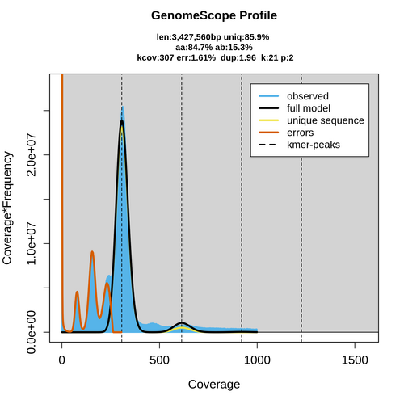 | --kcov 80, --ploidy 4 | 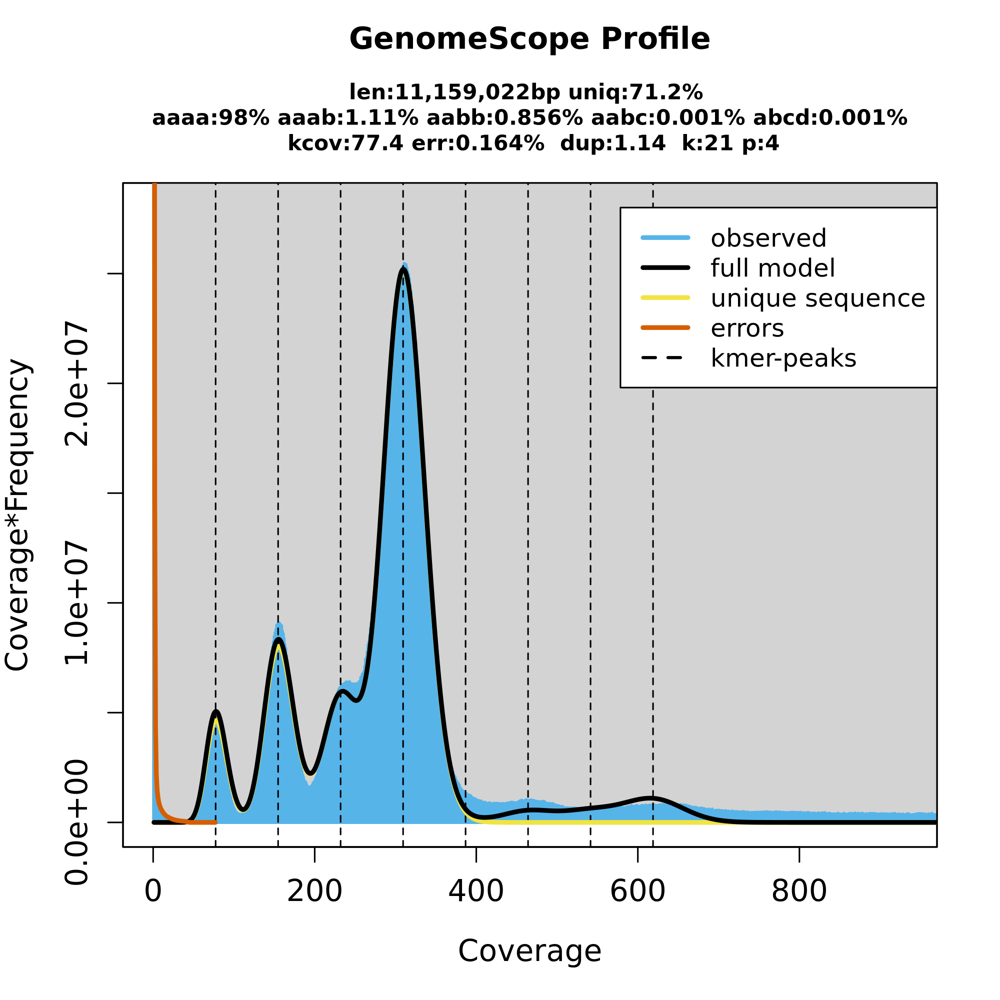 | 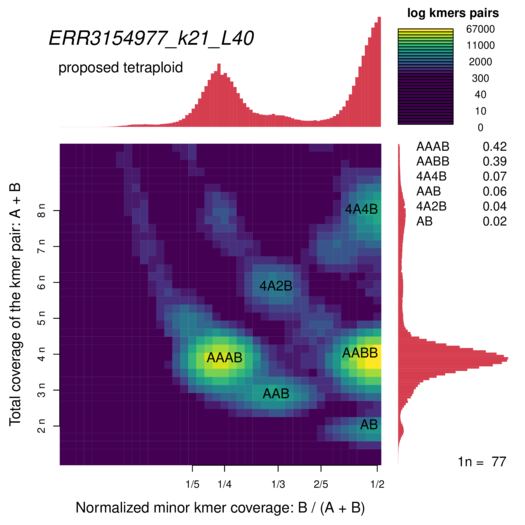 |
| SRR058692 | k21 | 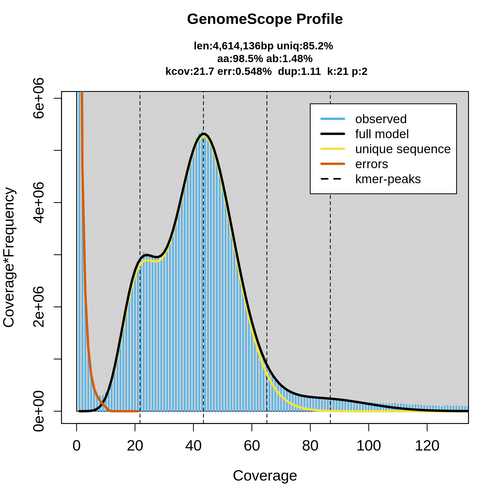 |  |  | 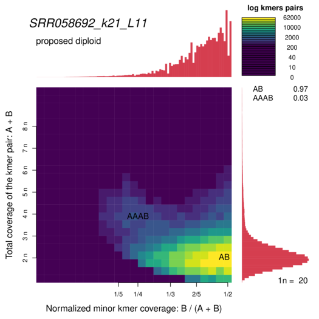 |
| SRR14017862 | k21 | 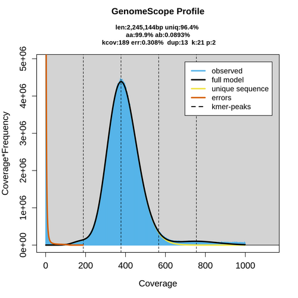 | --kcov 190, --ploidy 2 | 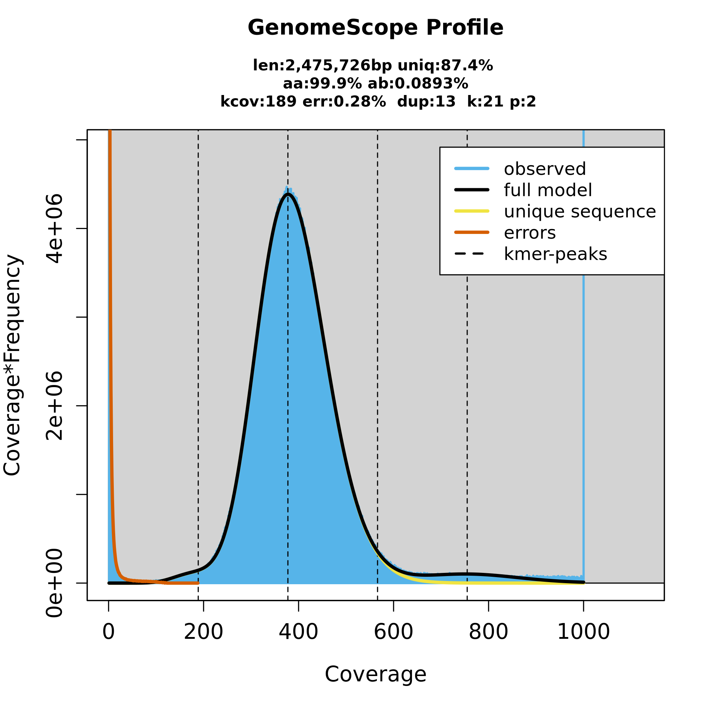 | 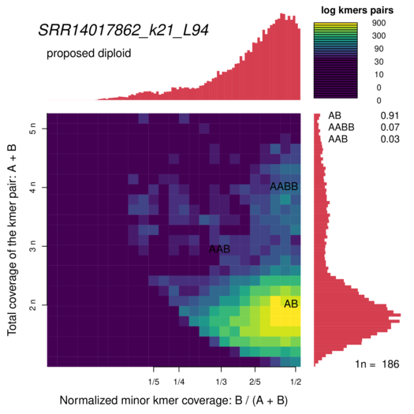 |
| SRR14017862 | k21 |  | --kcov 377, --ploidy 1 | 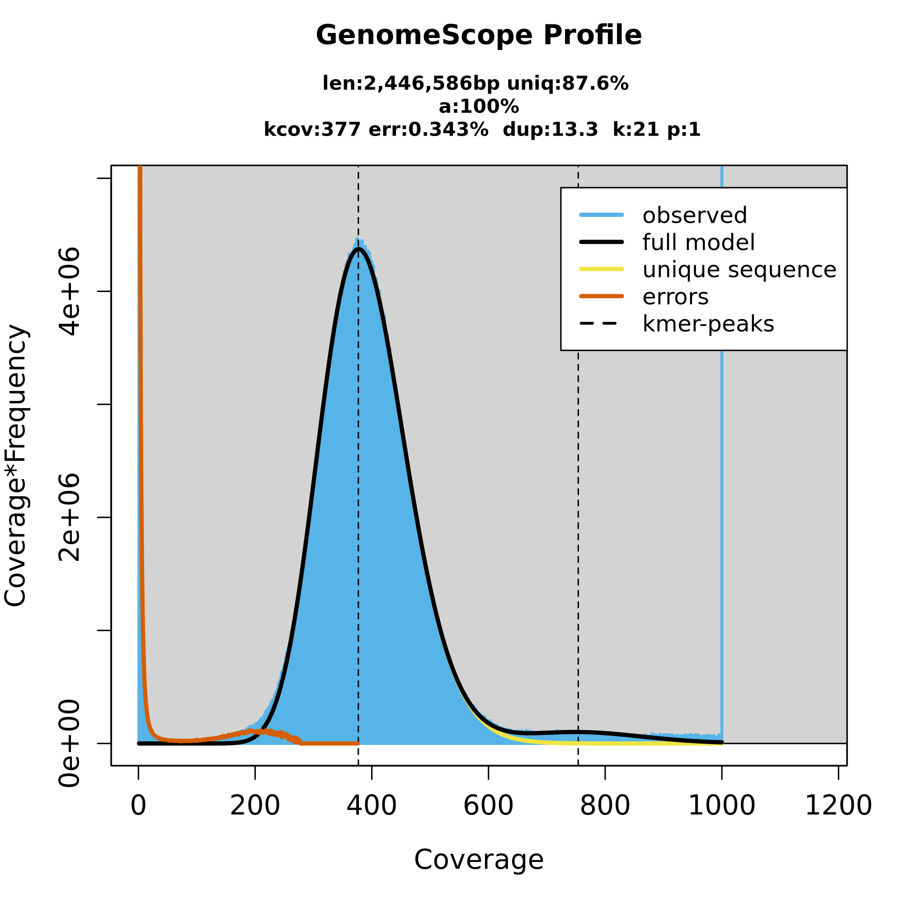 |  |
| SRR16954898 | k41 | 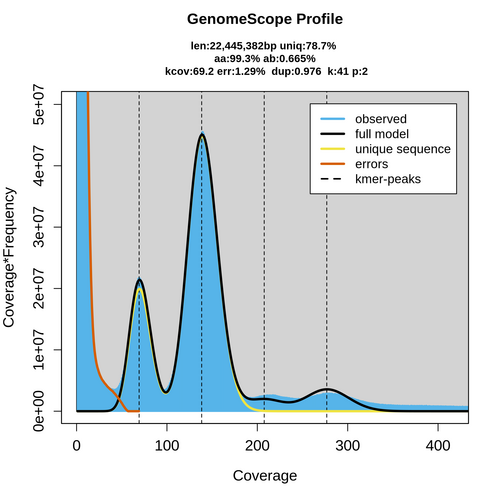 | |  |  |
| SRR17317293 | k21 | 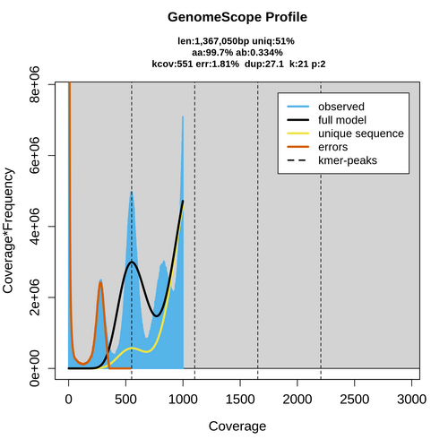 | --kcov 270, --ploidy 6 | 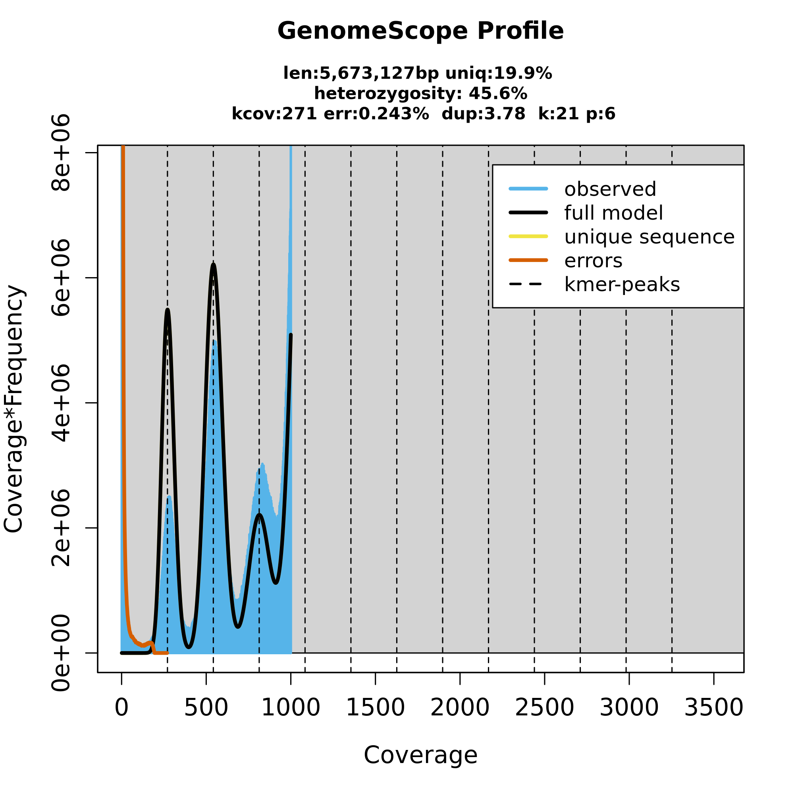 | 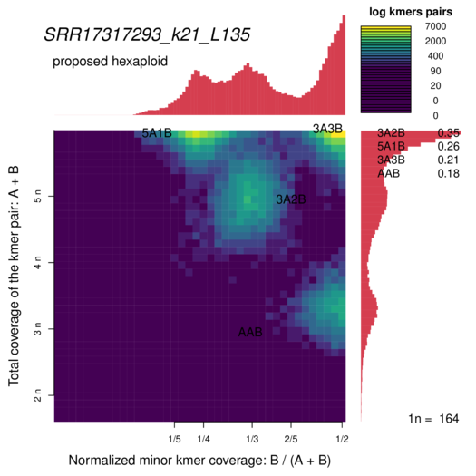 |
| SRR350188 | k21 | 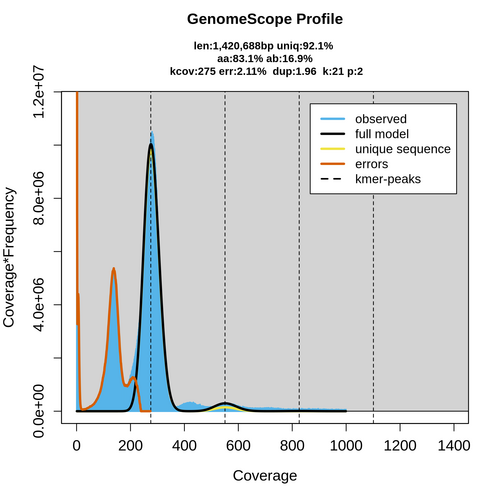 | 136 | 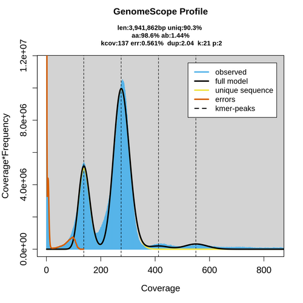 | 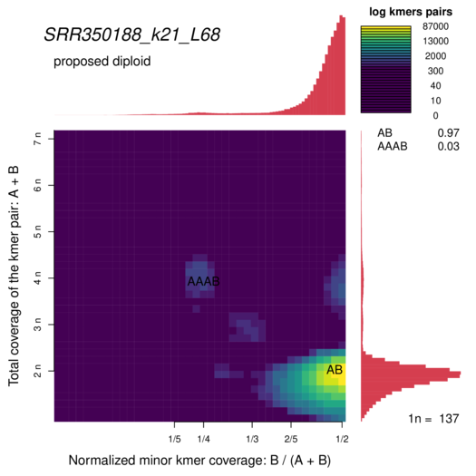 |
| SRR926312 | k21 | 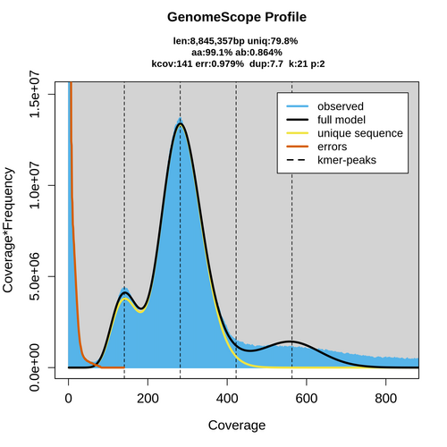 | 141 |  | 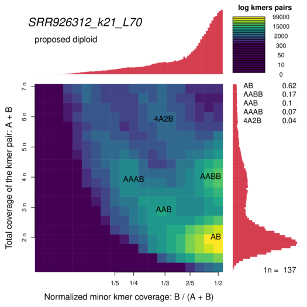 |
| SRR926341 | k21 | 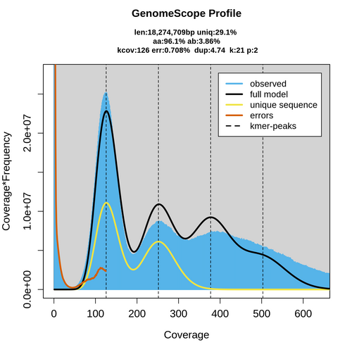 | --kcov 126, --ploidy 4 | 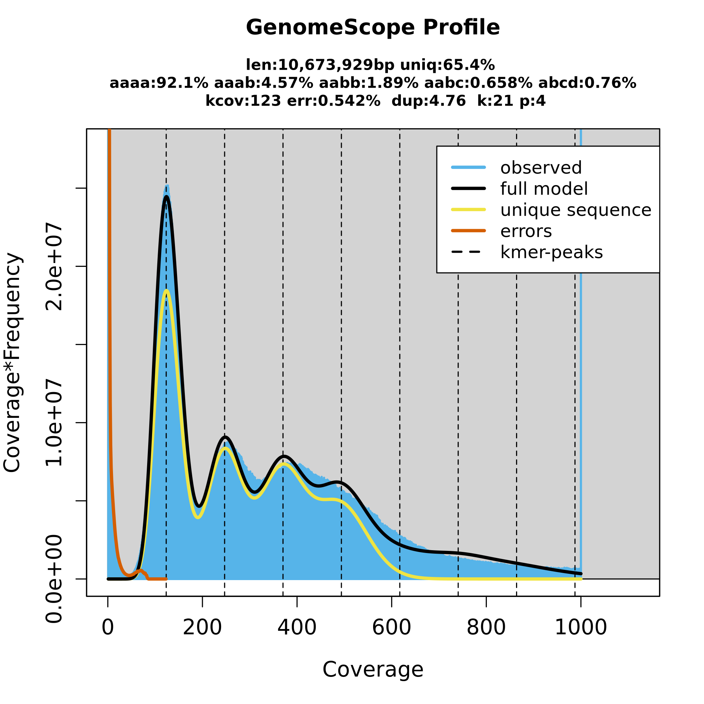 | 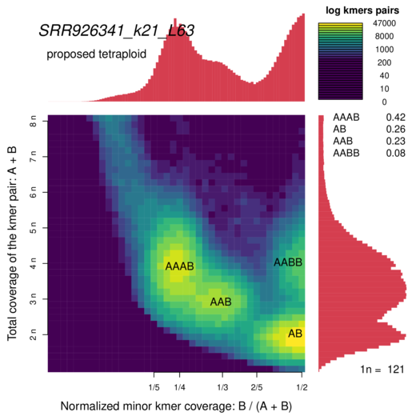 |